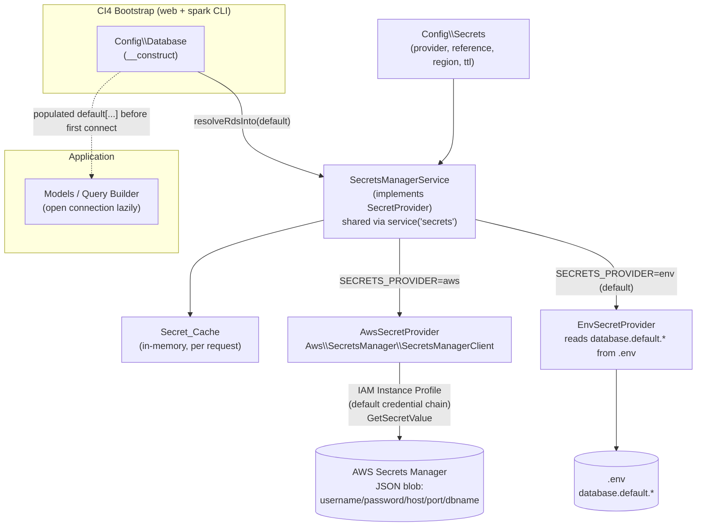
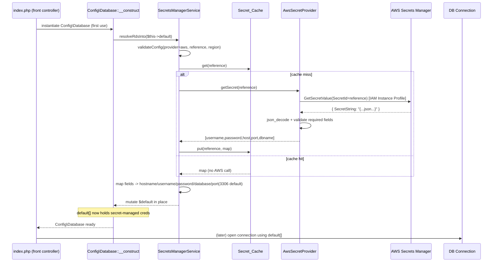
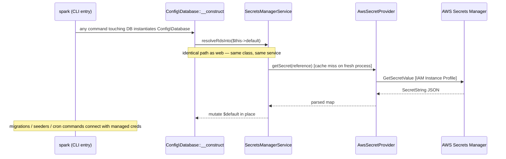
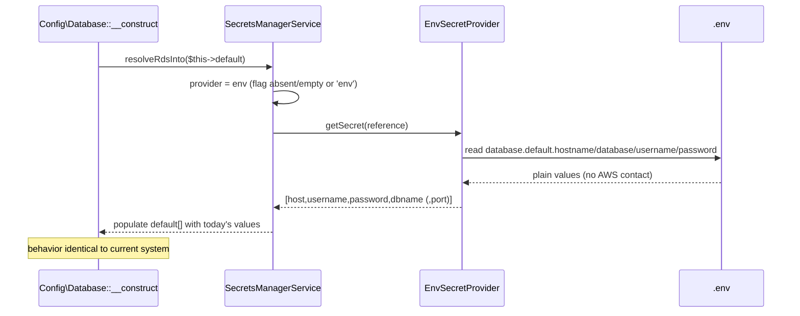
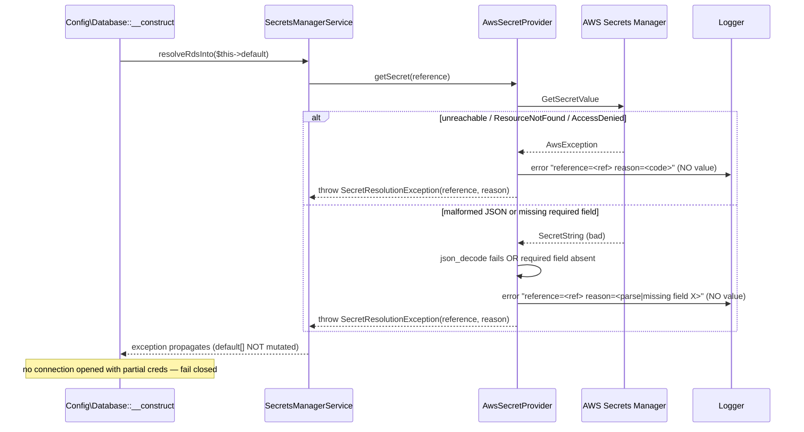

# Design Document: AWS Secrets Manager Integration for RDS Credentials

## Overview

This feature introduces a **secret-resolution abstraction** (`SecretsManagerService`) into the CodeIgniter 4 (PHP 8.2) application so that sensitive credentials — starting with the RDS database connection — are resolved at runtime from a secret **name/ARN** held in `.env`, instead of storing raw secret **values** in `.env`, `app/Config/Database.php`, or any committed artifact. The primary goal is to eliminate the risk of accidentally committing real credentials to GitHub.

The design deliberately **mirrors the sibling `s3-file-storage` spec**: a single `.env` switch (`SECRETS_PROVIDER=aws|env`) toggles between resolving secrets from AWS Secrets Manager and reading plain local `.env` values, exactly as `FILE_STORAGE_DRIVER=local|s3` toggles the storage layer. The layer exposes two swappable providers — `EnvSecretProvider` (reproduces today's plain-`.env` behavior) and `AwsSecretProvider` (fetches from AWS Secrets Manager via the IAM Instance Profile) — behind a `SecretProvider` interface, selected at runtime through `Config\Secrets->provider`. A shared service is registered in `Config\Services` so callers do `service('secrets')`, and the SDK client is built at most once per request.

The AWS SDK (`aws/aws-sdk-php ^3.365`, already a dependency) authenticates via the **IAM Instance Profile** default credential provider chain on EC2 — no AWS access keys are ever placed in the repository, preserving the security stance established in `INFRA_AWS_S3_MIGRACION.md` §4.2 and the `s3-file-storage` design (Property 10, "No secrets in artifacts"). The IAM policy attached to the instance profile must grant `secretsmanager:GetSecretValue` scoped to the configured secret.

Sensitive values in Secrets Manager are stored as a JSON blob (e.g. `{"username":"...","password":"...","host":"...","port":3306,"dbname":"..."}`); the resolver parses the JSON and maps its fields into CI4's `Config\Database` `default` connection group **before the first database connection is opened**. Resolved secrets are cached in memory for the request lifecycle to avoid repeated paid `GetSecretValue` calls, and resolved secret values are never logged, echoed, written to disk, or committed. On any failure (unreachable, missing, malformed, incomplete), resolution **fails closed** with an operator-facing error that names the secret reference and reason but never the value.

Existing deployments keep working unchanged with plain `.env` DB credentials until an operator flips `SECRETS_PROVIDER=aws`.

**In scope:** the secret-resolution abstraction with an `aws|env` provider switch; `Config\Secrets` bound to `.env` holding only the secret name/ARN + region + provider flag; RDS credential resolution (JSON parse → `Config\Database`) wired early in the CI4 bootstrap for both web and `spark` CLI; per-request caching with optional TTL; fail-closed error handling with secret-free logging; IAM Instance Profile authentication; a working local `env` fallback path; and operator documentation for creating the secret and adding the `secretsmanager:GetSecretValue` IAM permission.

**Out of scope (mentioned as related/future only):** automated secret rotation (Secrets Manager rotation lambdas), KMS key management specifics, and GroceryCrud-specific credential handling.

---

## Architecture

The application code and the framework never read database credentials from raw `.env` values or talk to the AWS SDK directly for secrets. All credential material flows through `SecretsManagerService`, which delegates to the active provider chosen by configuration and hands the resolved fields to `Config\Database` at bootstrap.



**Key architectural decisions:**

- **Single switch, two providers.** `SECRETS_PROVIDER` flips the whole app between AWS-resolved and plain-`.env` credentials with no application-code changes. Absent/empty defaults to `env`, so existing deployments are unaffected (Req 1.4, Req 10.1).
- **Resolution happens in `Config\Database::__construct`.** This is the single point CI4 instantiates before the first connection, and it already contains an override pattern (`DOCKER_DB_HOST`). Running there guarantees credentials are in place before any `Database\Connection` opens, and it works identically for the HTTP front controller and the `spark` CLI (Req 3.2, Req 3.6). See the Bootstrap Timing decision below.
- **IAM Instance Profile credentials.** The `SecretsManagerClient` is built from region only; the SDK's default provider chain reads temporary credentials from the EC2 metadata endpoint. No access keys in `.env` or the repository (Req 2.2, Req 6.1, Req 6.2).
- **Reference, not value, in `.env`.** `.env` holds only `SECRETS_PROVIDER`, `SECRETS_RDS_REFERENCE`, `SECRETS_REGION`, and optional `SECRETS_CACHE_TTL`. No secret values ever (Req 2.1, Req 8.4).
- **Per-request in-memory cache.** One `GetSecretValue` call per reference per request; cached material lives only in memory and dies with the request (Req 4.1, Req 4.2, Req 8.1).
- **Fail closed.** Any unreachable/missing/malformed/incomplete secret aborts resolution with a secret-free error; the app never connects with partial credentials (Req 3.3, Req 3.4, Req 5.1, Req 5.3).

### Bootstrap Timing decision (why `Config\Database::__construct`)

Three options were evaluated for getting resolved RDS credentials into the `default` group before the first connection:

| Option | Runs before first connect? | Works with `spark` CLI? | Verdict |
|---|---|---|---|
| (a) Preload hook in `index.php` / `app/Config/Boot/*` that `putenv()`s `database.default.*` | Only for web front controller; `spark` has its own entry (`public/../spark`) and Boot files are environment-specific | Not reliably | Rejected — duplicated wiring, easy to bypass on CLI |
| (b) Override `Config\Database::__construct` to call the resolver and set `$this->default[...]` | **Yes** — CI4 constructs `Config\Database` lazily the first time `Database::connect()`/`config('Database')` is used, always before a `Connection` opens | **Yes** — same class is loaded on both web and CLI | **Chosen** |
| (c) `Events::on('pre_system', …)` handler | Fires only through the HTTP bootstrap (`CodeIgniter::run`), not for every `spark` command; ordering vs. first connection is fragile | Not reliably | Rejected — CLI gap, ordering risk |

Option (b) is chosen because `Config\Database` is the one object guaranteed to be instantiated — on both the web and `spark` paths — before any connection is opened, and the file already demonstrates the override pattern (`DOCKER_DB_HOST`). The constructor calls `service('secrets')->resolveRdsInto($this->default)` guarded so that the `testing` environment (which uses the in-memory SQLite `tests` group) is never touched. Concrete code is in **Example Usage**.

---

## Sequence Diagrams

### Bootstrap resolution — AWS provider (web request)



### Bootstrap resolution — `spark` CLI



### Env fallback (local development)



### Failure path (fail closed, secret-free)



---

## Components and Interfaces

### Component 1: `SecretProvider` (interface)

**Purpose:** The secret-resolution contract. Both providers implement it; the service and all callers depend only on it. Mirrors the `FileStorage` interface role.

```php
<?php
namespace App\Libraries\Secrets;

interface SecretProvider
{
    /**
     * Resolve the secret identified by $reference into a flat key/value map.
     *
     * For the RDS secret the returned map contains at least:
     *   host, username, password, dbname  (port optional; defaults applied by caller)
     *
     * @param string $reference Secret name or ARN (Secret_Reference). Never a value.
     * @return array<string,string|int> Parsed secret material (in memory only).
     *
     * @throws SecretResolutionException on unreachable, missing, malformed,
     *         or incomplete secret. The exception message names the reference
     *         and reason and NEVER contains the secret value.
     */
    public function getSecret(string $reference): array;
}
```

### Component 2: `SecretsManagerService` (facade / factory)

**Purpose:** Resolve and cache the active provider from `Config\Secrets`, own the per-request `Secret_Cache`, and expose the single operation that maps a resolved RDS secret into a `Config\Database` group. Registered as a shared service (`service('secrets')`) so the provider and SDK client are built once per request. Mirrors `FileStorageService`.

```php
<?php
namespace App\Libraries\Secrets;

use Config\Secrets as SecretsConfig;

final class SecretsManagerService implements SecretProvider
{
    private SecretProvider $provider;
    private SecretsConfig $config;

    /** @var array<string, array{value: array<string,string|int>, expiresAt: int|null}> */
    private array $cache = [];

    public function __construct(SecretsConfig $config)
    {
        $this->config = $config;
        $this->provider = $this->makeProvider($config);   // throws on invalid provider flag
    }

    /** Req 1.2/1.3/1.4/1.5 — select provider by flag, fail on invalid. */
    private function makeProvider(SecretsConfig $c): SecretProvider
    {
        return match ($c->provider) {
            'aws' => new AwsSecretProvider($c),
            'env' => new EnvSecretProvider($c),
            default => throw new \InvalidArgumentException(
                "Invalid SECRETS_PROVIDER '{$c->provider}'. Accepted values: aws, env."
            ),
        };
    }

    /** Req 4 — cached resolution: one fetch per reference per request (+ optional TTL). */
    public function getSecret(string $reference): array
    {
        $now = time();
        if (isset($this->cache[$reference])) {
            $entry = $this->cache[$reference];
            if ($entry['expiresAt'] === null || $entry['expiresAt'] > $now) {
                return $entry['value'];               // cache hit — no provider call
            }
        }
        $value   = $this->provider->getSecret($reference);   // may throw (fail closed)
        $expires = $this->config->cacheTtl > 0 ? $now + $this->config->cacheTtl : null;
        $this->cache[$reference] = ['value' => $value, 'expiresAt' => $expires];
        return $value;
    }

    /**
     * Resolve the RDS secret and populate a Config\Database connection group in place.
     * Req 3.1/3.2/3.5, Req 7.1/7.3 — parse + field-map, default port 3306.
     *
     * @param array<string,mixed> $group Reference to Config\Database->default.
     */
    public function resolveRdsInto(array &$group): void
    {
        $this->assertConfigured();                    // Req 2.3/2.4/1.5
        $map = $this->getSecret($this->config->rdsReference);
        $group['hostname'] = (string) $map['host'];
        $group['username'] = (string) $map['username'];
        $group['password'] = (string) $map['password'];
        $group['database'] = (string) $map['dbname'];
        $group['port']     = (int) ($map['port'] ?? 3306);
    }

    /** Req 2.3/2.4 — reference + region required when provider=aws. */
    private function assertConfigured(): void
    {
        if ($this->config->provider === 'aws') {
            if (trim($this->config->rdsReference) === '') {
                throw new \InvalidArgumentException('SECRETS_RDS_REFERENCE is required when SECRETS_PROVIDER=aws.');
            }
            if (trim($this->config->region) === '') {
                throw new \InvalidArgumentException('SECRETS_REGION is required when SECRETS_PROVIDER=aws.');
            }
        }
    }
}
```

### Component 3: `EnvSecretProvider`

**Purpose:** Reproduce today's exact behavior so `env` mode is behavior-identical to the current system — reads plain `.env` DB keys and contacts nothing external.

**Responsibilities:**
- `getSecret`: read `database.default.hostname`, `database.default.database`, `database.default.username`, `database.default.password` via CI4 `env()` and return them mapped to the canonical keys (`host`, `dbname`, `username`, `password`, and `port` if `database.default.port` is present). The `$reference` argument is ignored for env (Req 7.1, Req 7.2, Req 7.3).
- Never contacts AWS; never throws for "unreachable" (there is no remote).

### Component 4: `AwsSecretProvider`

**Purpose:** Fetch secret material from AWS Secrets Manager using Instance Profile credentials, parse the JSON blob, and validate required fields.

**Responsibilities:**
- Build an `Aws\SecretsManager\SecretsManagerClient` from `version` + `region` only — **no `credentials` key**, so the SDK default provider chain reads temporary credentials from the EC2 metadata endpoint (Req 2.2, Req 6.1).
- `getSecret`: call `getSecretValue(['SecretId' => $reference])`, read `SecretString`, `json_decode`, validate required fields (`host`, `username`, `password`, `dbname`), and return the map. Missing/malformed → `SecretResolutionException` with a secret-free message (Req 3.1, Req 3.3, Req 3.4, Req 5.1).
- All logging goes through a redaction helper that logs only `reference` + `reason` and never the value (Req 5.2, Req 5.4, Req 8.2).

### Component 5: `Config\Secrets` (configuration)

**Purpose:** Bind the four `.env` keys to typed properties and hold NO secret values. Mirrors `Config\FileStorage`. Full class in **Data Models** / **Example Usage**.

### Component 6: `SecretResolutionException`

**Purpose:** A dedicated exception carrying the `Secret_Reference` and a `reason`, with a `__toString`/message contract that guarantees the `Secret_Value` is never embedded. Constructed only from reference + reason strings, never from raw secret material.

```php
<?php
namespace App\Libraries\Secrets;

final class SecretResolutionException extends \RuntimeException
{
    public function __construct(
        public readonly string $reference,
        public readonly string $reason,
    ) {
        // Message contains reference + reason only — never the secret value.
        parent::__construct(sprintf('Secret resolution failed [reference=%s]: %s', $reference, $reason));
    }
}
```

---

## Data Models

### Model 1: RDS secret JSON shape (stored in AWS Secrets Manager)

The secret value is a single JSON object. This is the only place the real credentials live; it is never mirrored into the repo.

```json
{
  "username": "sgl_app",
  "password": "•••••••••••",
  "host": "sgl-prod.abcdef.us-east-1.rds.amazonaws.com",
  "port": 3306,
  "dbname": "procedures"
}
```

**Field mapping to `Config\Database->default`:**

| Secret JSON field | `Config\Database` `default` key | Required | Default |
|---|---|---|---|
| `host` | `hostname` | yes (Req 3.4) | — |
| `username` | `username` | yes (Req 3.4) | — |
| `password` | `password` | yes (Req 3.4) | — |
| `dbname` | `database` | yes (Req 3.4) | — |
| `port` | `port` | no (Req 3.5) | `3306` |

**Validation rules (fail closed):**
- `SecretString` must be non-empty and valid JSON, else reject with reason `invalid-json` (Req 3.3).
- Each of `host`, `username`, `password`, `dbname` must be present and a non-empty scalar, else reject with reason `missing-field:<name>` (Req 3.4).
- `port`, when present, must be a positive integer; when absent, `3306` is applied (Req 3.5).
- On any rejection, the offending value is **never** included in the error/log (Req 3.3, Req 3.4, Req 5.2).

### Model 2: `Config\Secrets` (holds references only, never values)

```php
<?php
namespace Config;

use CodeIgniter\Config\BaseConfig;

/**
 * Secrets configuration.
 *
 * A single provider switch (`provider`) flips credential resolution between
 * AWS Secrets Manager and plain local .env, mirroring Config\FileStorage.
 *
 * Bound environment variables:
 *   - provider     <- SECRETS_PROVIDER        (aws | env)   default 'env'
 *   - rdsReference <- SECRETS_RDS_REFERENCE   (secret name or ARN)
 *   - region       <- SECRETS_REGION          (AWS region)
 *   - cacheTtl     <- SECRETS_CACHE_TTL        (seconds; 0 = whole request)
 *
 * IMPORTANT (security): there are intentionally NO secret VALUE settings here
 * and NO AWS access-key/secret-key settings. On the aws provider the SDK
 * resolves temporary credentials from the EC2 IAM Instance Profile. Only the
 * secret REFERENCE, region, and provider flag live in config/.env.
 */
class Secrets extends BaseConfig
{
    /** Active provider: 'aws' or 'env'. Defaults to 'env' (current behavior). */
    public string $provider = 'env';

    /** Secret name or ARN for the RDS credentials secret. Never a value. */
    public string $rdsReference = '';

    /** AWS region for the SecretsManagerClient (aws provider only). */
    public string $region = 'us-east-1';

    /** Per-request cache TTL in seconds. 0 = valid for the whole request. */
    public int $cacheTtl = 0;

    public function __construct()
    {
        parent::__construct();

        $provider = strtolower(trim((string) env('SECRETS_PROVIDER', '')));
        if ($provider !== '') {
            $this->provider = $provider;      // 'env' default preserved when absent (Req 1.4, 10.1)
        }

        $reference = trim((string) env('SECRETS_RDS_REFERENCE', ''));
        if ($reference !== '') {
            $this->rdsReference = $reference;
        }

        $region = trim((string) env('SECRETS_REGION', ''));
        if ($region !== '') {
            $this->region = $region;
        }

        $ttl = env('SECRETS_CACHE_TTL', null);
        if ($ttl !== null && $ttl !== '' && is_numeric($ttl)) {
            $this->cacheTtl = max(0, (int) $ttl);
        }
    }
}
```

### Model 3: Secret_Cache entry (in-memory, per request)

```php
// Keyed by Secret_Reference. Lives only in the SecretsManagerService instance,
// which is a per-request shared service. Never serialized to disk.
[
  '<reference>' => [
     'value'     => ['host' => ..., 'username' => ..., 'password' => ..., 'dbname' => ..., 'port' => 3306],
     'expiresAt' => null | <unix-ts>,   // null => valid for remainder of request (Req 4.4)
  ],
]
```

---

## Algorithmic Pseudocode

### Algorithm: Resolve RDS secret and populate `Config\Database`

```pascal
ALGORITHM resolveRdsInto(group)               // group is Config\Database->default (by ref)
INPUT:  group (map), config (Config\Secrets)
OUTPUT: none (mutates group) or raises SecretResolutionException / InvalidArgumentException

BEGIN
  // Provider selection already happened in constructor (fail on invalid flag).
  IF config.provider = "aws" THEN
    IF trim(config.rdsReference) = "" THEN RAISE InvalidArgument("reference required") END IF   // Req 2.3
    IF trim(config.region)       = "" THEN RAISE InvalidArgument("region required")    END IF   // Req 2.4
  END IF

  map <- getSecretCached(config.rdsReference)      // may RAISE (fail closed)   // Req 4, 5

  group.hostname <- str(map.host)
  group.username <- str(map.username)
  group.password <- str(map.password)
  group.database <- str(map.dbname)
  group.port     <- IF map HAS "port" THEN int(map.port) ELSE 3306 END IF       // Req 3.5
END
```

**Preconditions:** service constructed (provider flag valid); called from `Config\Database::__construct` before first connection.
**Postconditions:** on success `group` holds complete, validated credentials; on any failure `group` is left unmodified and an exception propagates (no partial credentials, Req 3.3/3.4/5.3).

### Algorithm: Cached fetch (one call per reference per request)

```pascal
ALGORITHM getSecretCached(reference)
BEGIN
  now <- currentUnixTime()
  IF cache HAS reference THEN
    entry <- cache[reference]
    IF entry.expiresAt = NULL OR entry.expiresAt > now THEN
      RETURN entry.value                         // cache hit — NO provider call   // Req 4.2
    END IF
  END IF

  value   <- provider.getSecret(reference)       // AWS or env; may RAISE
  expires <- IF config.cacheTtl > 0 THEN now + config.cacheTtl ELSE NULL END IF    // Req 4.3/4.4
  cache[reference] <- { value: value, expiresAt: expires }                          // Req 4.1
  RETURN value
END
```

**Loop invariants:** at most one successful `provider.getSecret(reference)` executes per reference per request while the entry remains unexpired.

### Algorithm: AWS fetch + JSON parse + validate

```pascal
ALGORITHM AwsSecretProvider.getSecret(reference)
BEGIN
  TRY
    result <- client.getSecretValue({ SecretId: reference })   // IAM Instance Profile creds
  CATCH AwsException e
    logRedacted(reference, awsReason(e))                       // NO value      // Req 5.2
    RAISE SecretResolutionException(reference, awsReason(e))   // unreachable / not-found / denied  // Req 5.1
  END TRY

  raw <- result["SecretString"]
  IF raw = NULL OR raw = "" THEN
    logRedacted(reference, "empty-secret-string")
    RAISE SecretResolutionException(reference, "empty-secret-string")
  END IF

  parsed <- jsonDecode(raw)
  IF jsonError() OR NOT isObject(parsed) THEN
    logRedacted(reference, "invalid-json")                     // NEVER log raw   // Req 3.3
    RAISE SecretResolutionException(reference, "invalid-json")
  END IF

  FOR EACH field IN ["host", "username", "password", "dbname"] DO                 // Req 3.4
    IF NOT parsed HAS field OR isEmpty(parsed[field]) THEN
      logRedacted(reference, "missing-field:" + field)
      RAISE SecretResolutionException(reference, "missing-field:" + field)
    END IF
  END FOR

  IF parsed HAS "port" AND NOT isPositiveInt(parsed.port) THEN
    logRedacted(reference, "invalid-port")
    RAISE SecretResolutionException(reference, "invalid-port")
  END IF

  RETURN parsed        // in-memory map only; never persisted   // Req 8.1/8.3
END
```

**Preconditions:** SDK client built from region only; Instance Profile grants `secretsmanager:GetSecretValue` on `reference`.
**Postconditions:** returns a validated map, or raises with a secret-free reason; nothing about the value reaches logs or disk.

### Algorithm: Env fetch (fallback, no AWS)

```pascal
ALGORITHM EnvSecretProvider.getSecret(reference)   // reference ignored
BEGIN
  map.host     <- env("database.default.hostname")                                // Req 7.1
  map.dbname   <- env("database.default.database")
  map.username <- env("database.default.username")
  map.password <- env("database.default.password")
  port <- env("database.default.port")
  IF port <> NULL AND port <> "" THEN map.port <- int(port) END IF
  RETURN map        // whatever the app uses today; missing keys stay as CI4 defaults  // Req 7.3
END
```

**Note:** `EnvSecretProvider` does not fail-closed on absent keys — it returns what `.env` provides so that when the flag is absent the app is byte-for-byte identical to today's plain-`.env` configuration, where `Config\Database` supplies its own hardcoded defaults for any key not present (Req 7.3, Req 10.1). `resolveRdsInto` only overwrites `group` keys for values the provider returns.

### Algorithm: Secret-free logging (redaction)

```pascal
ALGORITHM logRedacted(reference, reason)
BEGIN
  // ONLY reference + reason. The value is never passed into this function.
  log_message("error", "Secrets: reference=" + reference + " reason=" + reason)   // Req 5.2/5.4/8.2
END
```

---

## Key Functions with Formal Specifications

### `SecretsManagerService::resolveRdsInto(array &$group): void`
- **Preconditions:** service constructed with a valid provider flag; `$group` is a `Config\Database` connection-group array (typically `default`).
- **Postconditions:** on success `$group['hostname'|'username'|'password'|'database'|'port']` are set from the validated secret, with `port` defaulting to `3306`; on failure `$group` is unchanged and a `SecretResolutionException`/`InvalidArgumentException` propagates (fail closed). Idempotent: calling twice in a request re-uses the cached value and yields the same `$group`.
- **Loop invariants:** N/A.

### `SecretsManagerService::getSecret(string $reference): array`
- **Preconditions:** `$reference` non-empty when provider is `aws`.
- **Postconditions:** returns the resolved map; performs at most one underlying `provider.getSecret` call per reference per request while cached and unexpired (Req 4.2); pure w.r.t. external state after the first successful fetch.
- **Loop invariants:** cache holds at most one entry per reference.

### `AwsSecretProvider::getSecret(string $reference): array`
- **Preconditions:** SDK client built from region only; Instance Profile grants `GetSecretValue`.
- **Postconditions:** returns a map containing non-empty `host`, `username`, `password`, `dbname` (and optional valid `port`); otherwise raises `SecretResolutionException` whose message excludes the secret value. No secret material is written to logs or disk.
- **Loop invariants:** the required-field loop raises on the first missing field.

### `EnvSecretProvider::getSecret(string $reference): array`
- **Preconditions:** none (reads local `.env`).
- **Postconditions:** returns the mapped `database.default.*` values as they exist today; never contacts AWS; never raises for connectivity.
- **Loop invariants:** N/A.

---

## Example Usage

### Config wiring — `.env` (references only, NO values)

```dotenv
#--------------------------------------------------------------------
# SECRETS (AWS Secrets Manager abstraction)
#--------------------------------------------------------------------
# Active secret provider: aws | env. Defaults to 'env' (current behavior).
# SECRETS_PROVIDER = env

# Secret NAME or ARN for the RDS credentials secret (aws provider only).
# This is a REFERENCE, never a value. No passwords ever live in .env.
# SECRETS_RDS_REFERENCE = sgl/prod/rds-credentials

# AWS region for the SecretsManagerClient (aws provider only).
# SECRETS_REGION = us-east-1

# Optional per-request cache TTL in seconds. 0 or unset = valid for the
# whole request. There are intentionally NO access-key/secret-key settings:
# credentials come from the EC2 IAM Instance Profile.
# SECRETS_CACHE_TTL = 0
```

### Bootstrap hook — `app/Config/Database.php` (the resolution point)

```php
public function __construct()
{
    parent::__construct();

    // Existing Docker override (unchanged).
    $dockerDbHost = trim((string) env('DOCKER_DB_HOST', ''));
    if ($dockerDbHost !== '') {
        $this->default['hostname'] = $dockerDbHost;
    }

    if (ENVIRONMENT === 'testing') {
        // tests group (in-memory SQLite) — never resolve secrets here.
        $this->defaultGroup = 'tests';
        return;
    }

    // Resolve RDS credentials into the 'default' group BEFORE the first
    // connection is opened. Runs identically for web and `spark` CLI because
    // Config\Database is instantiated on both paths before any Connection.
    // Fail closed: any resolution error propagates and prevents connecting
    // with partial credentials (Req 3.2, 3.6, 5.3).
    service('secrets')->resolveRdsInto($this->default);
}
```

> Note: with `SECRETS_PROVIDER` absent or `env`, `resolveRdsInto` populates `default` from the same `database.default.*` values used today, so this hook is a no-op change for existing deployments (Req 10.1).

### Service registration — `app/Config/Services.php`

```php
/**
 * Shared secrets-resolution service.
 *
 * Resolves the active provider (aws|env) from Config\Secrets and exposes it
 * via service('secrets'). Shared so the SDK client + cache are built once
 * per request (one GetSecretValue per reference per request).
 */
public static function secrets(bool $getShared = true)
{
    if ($getShared) {
        return static::getSharedInstance('secrets');
    }

    return new \App\Libraries\Secrets\SecretsManagerService(config('Secrets'));
}
```

### AWS SDK client construction (Instance Profile — no keys)

```php
use Aws\SecretsManager\SecretsManagerClient;

$this->client = new SecretsManagerClient([
    'version' => '2017-10-17',
    'region'  => $config->region,
    // No 'credentials' key: the SDK default provider chain reads temporary
    // credentials from the EC2 Instance Metadata endpoint (IAM Instance Profile).
]);
```

### `AwsSecretProvider::getSecret` (fetch + parse + validate + redacted logging)

```php
public function getSecret(string $reference): array
{
    try {
        $result = $this->client->getSecretValue(['SecretId' => $reference]);
    } catch (\Aws\Exception\AwsException $e) {
        $reason = $e->getAwsErrorCode() ?? 'aws-error';
        log_message('error', "Secrets: reference={$reference} reason={$reason}"); // no value
        throw new SecretResolutionException($reference, $reason);
    }

    $raw = $result['SecretString'] ?? '';
    if ($raw === '') {
        log_message('error', "Secrets: reference={$reference} reason=empty-secret-string");
        throw new SecretResolutionException($reference, 'empty-secret-string');
    }

    $parsed = json_decode($raw, true);
    if (json_last_error() !== JSON_ERROR_NONE || ! is_array($parsed)) {
        log_message('error', "Secrets: reference={$reference} reason=invalid-json"); // never log $raw
        throw new SecretResolutionException($reference, 'invalid-json');
    }

    foreach (['host', 'username', 'password', 'dbname'] as $field) {
        if (! isset($parsed[$field]) || $parsed[$field] === '') {
            log_message('error', "Secrets: reference={$reference} reason=missing-field:{$field}");
            throw new SecretResolutionException($reference, "missing-field:{$field}");
        }
    }

    return $parsed; // in-memory only
}
```

### AWS secret creation (operator CLI)

```bash
# Create the RDS credentials secret as a JSON blob (values live ONLY here).
aws secretsmanager create-secret \
  --name "sgl/prod/rds-credentials" \
  --description "SGL production RDS credentials" \
  --secret-string '{"username":"sgl_app","password":"REPLACE_ME","host":"sgl-prod.abcdef.us-east-1.rds.amazonaws.com","port":3306,"dbname":"procedures"}' \
  --region us-east-1

# Rotate/replace later without touching the repo:
aws secretsmanager put-secret-value \
  --secret-id "sgl/prod/rds-credentials" \
  --secret-string '{"username":"sgl_app","password":"NEW_VALUE","host":"...","port":3306,"dbname":"procedures"}' \
  --region us-east-1
```

### IAM policy statement (attach to the EC2 Instance Profile role)

```json
{
  "Version": "2012-10-17",
  "Statement": [
    {
      "Sid": "AllowReadSglRdsSecret",
      "Effect": "Allow",
      "Action": "secretsmanager:GetSecretValue",
      "Resource": "arn:aws:secretsmanager:us-east-1:<ACCOUNT_ID>:secret:sgl/prod/rds-credentials-*"
    }
  ]
}
```

> The trailing `-*` matches the six random suffix characters AWS appends to secret ARNs. Scope stays limited to this one secret (least privilege, Req 6.3).

### Enabling / reverting (operator)

```bash
# Enable AWS resolution:
#   SECRETS_PROVIDER      = aws
#   SECRETS_RDS_REFERENCE = sgl/prod/rds-credentials
#   SECRETS_REGION        = us-east-1
# Revert (instant rollback): set SECRETS_PROVIDER = env (or remove it).
```

---

## Correctness Properties

*A property is a characteristic or behavior that should hold true across all valid executions of a system — essentially, a formal statement about what the system should do. Properties serve as the bridge between human-readable specifications and machine-verifiable correctness guarantees.*

### Property 1: Provider transparency and selection

*For any* provider flag value in `{aws, env}` (and for the absent/empty flag, which defaults to `env`), resolving the RDS secret through the single `SecretsManagerService` interface produces a fully-populated connection group using the provider-appropriate backend, without any change to caller code.

**Validates: Requirements 1.2, 1.3, 1.4, 1.6, 10.1, 10.2, 10.3**

### Property 2: JSON field-mapping correctness with port default

*For any* valid RDS secret JSON object (arbitrary host, username, password including special/unicode characters, dbname, and optional port), parsing and mapping yields a group where `hostname=host`, `username=username`, `password=password`, `database=dbname`, and `port` equals the given port when present or `3306` when omitted.

**Validates: Requirements 3.1, 3.5**

### Property 3: Cache performs at most one fetch per reference per request

*For any* number `k ≥ 1` of resolutions of the same `Secret_Reference` within a request (with no TTL, or within an unexpired TTL window), the underlying provider is invoked exactly once and every resolution returns equal material; when a configured TTL has elapsed, the next resolution triggers exactly one refetch.

**Validates: Requirements 4.1, 4.2, 4.3, 4.4**

### Property 4: Fail closed on invalid config or unresolvable secret

*For any* failure mode — missing/empty reference or region under `aws`, unreachable Secrets Manager, non-existent reference, access denied, invalid JSON, or a missing required field (`host`/`username`/`password`/`dbname`) — resolution raises an error that names the `Secret_Reference` (and, where applicable, the missing field) and leaves the target connection group unmodified, so no connection is ever opened with partial credentials.

**Validates: Requirements 2.3, 2.4, 3.3, 3.4, 5.1, 5.3, 3.6**

### Property 5: Secret value never appears in logs or error messages

*For any* secret value and *any* error path exercised during resolution, no emitted log entry and no exception message contains the secret value; messages carry only the reference and a reason code.

**Validates: Requirements 5.2, 5.4, 8.2, 8.3**

### Property 6: Env provider passes through today's `.env` values unchanged

*For any* assignment of `database.default.hostname/database/username/password` (and optional `port`) in `.env`, the `EnvSecretProvider` resolves a group whose fields equal exactly those values, contacting no AWS service — reproducing the application's current configuration.

**Validates: Requirements 7.1, 7.2, 7.3, 10.1**

### Property 7: Invalid provider flag is rejected

*For any* provider flag string that is neither `aws` nor `env` (and non-empty), constructing the service raises a descriptive error whose message contains the offending value and the accepted values `aws` and `env`.

**Validates: Requirements 1.5**

### Property 8: No secrets in artifacts

*For all* files in the repository (`.env`, `Config\Secrets`, other config, documentation), no AWS access key or secret access key and no RDS secret value is present; only the `Secret_Reference`, region, and provider flag appear. The `SecretsManagerClient` is constructed with no literal `credentials`.

**Validates: Requirements 2.1, 2.2, 6.1, 6.2, 8.4**

---

## Error Handling

### Scenario: Invalid `SECRETS_PROVIDER` value
- **Condition:** flag holds a value other than `aws`/`env` (e.g. `s3`, typo).
- **Response:** `SecretsManagerService` constructor throws `InvalidArgumentException` naming the value and accepted set (`aws`, `env`); no provider is built.
- **Recovery:** operator fixes the flag. Fail closed — no connection attempt.

### Scenario: `aws` provider with missing reference or region
- **Condition:** `SECRETS_PROVIDER=aws` but `SECRETS_RDS_REFERENCE` or `SECRETS_REGION` is empty/whitespace.
- **Response:** `resolveRdsInto` throws `InvalidArgumentException` identifying the missing item before any AWS call; `default` group unmodified.
- **Recovery:** operator sets the missing `.env` key.

### Scenario: Secrets Manager unreachable / reference not found / access denied
- **Condition:** network failure, `ResourceNotFoundException`, or `AccessDeniedException` from `GetSecretValue`.
- **Response:** `AwsSecretProvider` logs `reference=<ref> reason=<awsErrorCode>` (no value) and throws `SecretResolutionException`; `default` unmodified.
- **Recovery:** operator attaches/repairs the Instance Profile policy or creates the secret. App does not connect with partial credentials (Req 5.1, 5.3). Reverting to `SECRETS_PROVIDER=env` is an immediate rollback.

### Scenario: Malformed secret (invalid JSON or empty `SecretString`)
- **Condition:** the secret value is not a valid JSON object, or `SecretString` is empty.
- **Response:** throw `SecretResolutionException(reference, "invalid-json"|"empty-secret-string")`; the raw value is **never** logged (Req 3.3).
- **Recovery:** operator corrects the secret via `put-secret-value`.

### Scenario: Secret missing a required field
- **Condition:** JSON object lacks a non-empty `host`, `username`, `password`, or `dbname`.
- **Response:** throw `SecretResolutionException(reference, "missing-field:<name>")`; other field values are never logged (Req 3.4).
- **Recovery:** operator adds the missing field to the secret.

### Scenario: Port omitted or invalid
- **Condition:** `port` absent → default `3306` applied (Req 3.5). `port` present but not a positive integer → `SecretResolutionException(reference, "invalid-port")` (fail closed).
- **Recovery:** for invalid port, operator fixes the secret; omission is handled automatically.

### Scenario: `testing` environment
- **Condition:** PHPUnit run (`ENVIRONMENT === 'testing'`).
- **Response:** `Config\Database::__construct` selects the in-memory `tests` group and returns before calling the resolver — secrets are never resolved during tests, avoiding live AWS calls.
- **Recovery:** N/A (by design).

---

## Testing Strategy

### Unit testing approach
- **Provider contract tests** run the same expectations against `EnvSecretProvider` (with `database.default.*` set in a test env) and `AwsSecretProvider` (using the AWS SDK **`MockHandler`** to return canned `GetSecretValue` results — no live AWS): `getSecret` returns a map with the required keys; `resolveRdsInto` populates `hostname/username/password/database/port`.
- **JSON mapping / validation** table-driven tests: well-formed blob, blob without `port`, malformed JSON, each required field removed in turn, empty `SecretString`, invalid `port`.
- **Redaction** tests: drive each error path with a known secret value and assert the value never appears in captured logs or the exception message.
- **Provider selection** tests: `aws`→`AwsSecretProvider`, `env`→`EnvSecretProvider`, absent/empty→`env`, invalid→`InvalidArgumentException` mentioning the value and accepted set.
- **Bootstrap integration** test: a failing resolver prevents `Database::connect()` from opening a connection (fail closed).

### Property-based testing approach
Property tests focus on the driver-independent invariants above. **No new dependency** is introduced: generators are expressed with **PHPUnit data providers** producing randomized inputs (arbitrary hosts, ports, dbnames, and passwords with special/unicode characters; arbitrary invalid flag strings; the enumerated failure modes), consistent with the `s3-file-storage` approach. The `AwsSecretProvider` is exercised through the SDK `MockHandler` so property runs make no network calls. Each property test runs a **minimum of 100 iterations** and is tagged:

`// Feature: aws-secrets-manager, Property {number}: {property_text}`

Mapping of properties to tests:
- **P1 transparency / P6 env pass-through / P7 invalid-flag / P2 field-mapping+port-default** — pure/mocked, ideal for PBT.
- **P3 cache single-fetch** — `MockHandler` with a call counter asserts exactly one `GetSecretValue` per reference across `k` random resolutions (inject a clock for TTL expiry).
- **P4 fail-closed / P5 no-value-in-logs** — generate the failure space and random secret values; assert raise + group-unchanged + value-absent-from-logs.
- **P8 no-secrets-in-artifacts** — a repository-scan test (static generator over tracked files) asserts no access-key patterns or known secret values appear in `.env`/config/docs, and that the client config carries no `credentials` key.

### Integration testing approach
- End-to-end bootstrap with `SECRETS_PROVIDER` toggled between `env` and `aws` (the latter against a sandbox secret or `MockHandler`) confirming the `default` group is populated before the first query, for both a web request and a `spark` command (Req 3.2, 3.6).
- Instance-Profile smoke test in staging: with the IAM policy attached, a real `GetSecretValue` succeeds; with it detached, resolution fails closed and logs a secret-free error.

---

## Dependencies

- **`aws/aws-sdk-php ^3.365`** — already a dependency; uses `Aws\SecretsManager\SecretsManagerClient` and `Aws\Exception\AwsException`.
- **CodeIgniter 4** service container, `Config\BaseConfig`, and `spark` CLI (existing).
- **AWS SDK `MockHandler`** (bundled with the SDK) for `AwsSecretProvider` unit/property tests — no live AWS.
- **PHPUnit** (existing dev dependency) with data-provider generators for property tests — no new PBT library.
- **IAM Instance Profile** attached to the EC2 with a least-privilege policy granting `secretsmanager:GetSecretValue` on the configured secret — infra prerequisite.

---

## Security Considerations

- **Reference, not value, in the repo.** `.env`/config hold only `SECRETS_PROVIDER`, `SECRETS_RDS_REFERENCE`, `SECRETS_REGION`, `SECRETS_CACHE_TTL` (Property 8).
- **IAM Instance Profile, least privilege.** No access keys anywhere; policy limited to `GetSecretValue` on the single secret ARN (Req 6.3).
- **In-memory only.** Resolved values live in the per-request service instance and die with the request; never serialized to disk (Req 8.1, 8.3).
- **Secret-free diagnostics.** Every log/exception carries only reference + reason; raw `SecretString` and field values are never emitted (Property 5).
- **Fail closed.** The app never connects with partial or unknown credentials (Property 4).
- **Instant rollback.** Setting `SECRETS_PROVIDER=env` reverts to plain `.env` with no code change.

---

## Related / Future Concerns (out of scope for this feature)

- **Automated secret rotation.** Secrets Manager rotation lambdas and rotation schedules are out of scope; the per-request cache with optional TTL is sufficient for manual rotation via `put-secret-value` (a fresh request picks up the new value). 
- **KMS key management specifics.** Choice of CMK vs. AWS-managed key and key policies for the secret are out of scope; the default encryption of Secrets Manager is assumed.
- **GroceryCrud credential handling.** GroceryCrud Enterprise's own DB configuration is not re-wired through this service in this feature; addressed when GroceryCrud is retired.
