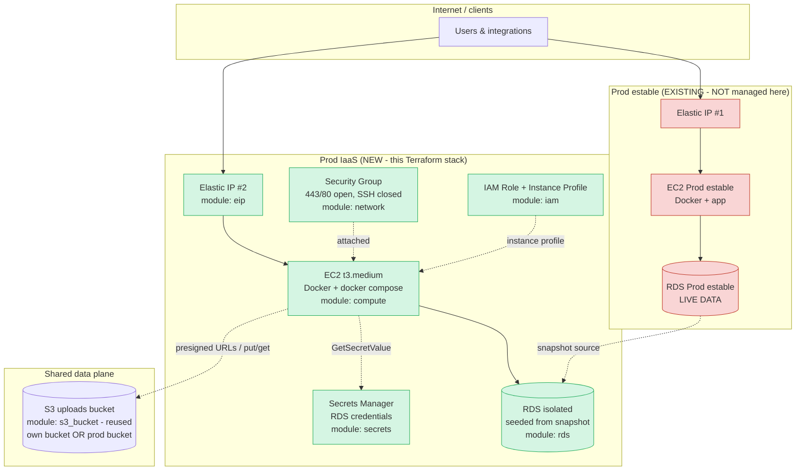
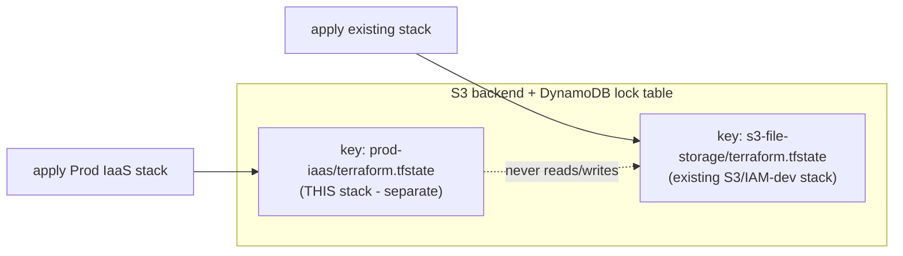
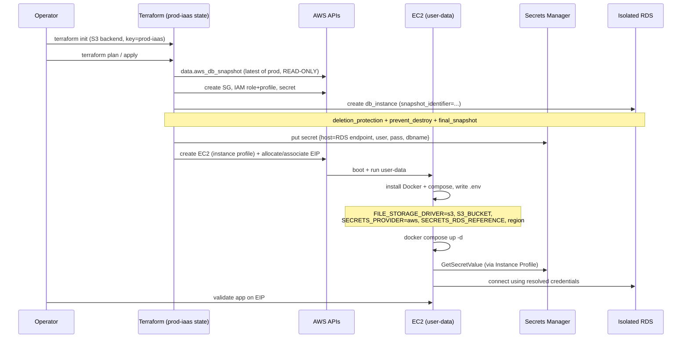

# Design Document: Prod IaaS (Terraform, parallel production server)

## Overview

This feature provisions a **second, parallel production server ("Prod IaaS")** for the SGL
application **entirely through Terraform**, without touching the existing production server
("Prod estable") or its resources. The two servers run side by side, each with its own
public Elastic IP, in a **blue/green style parallel deployment**. The eventual DNS/EIP cutover
to Prod IaaS is a later, separate step and is explicitly out of scope here.

The design leans on work already completed and validated in dev: the application is **stateless**
(file storage on S3 via `FILE_STORAGE_DRIVER=s3`, DB credentials resolved at runtime from AWS
Secrets Manager via `SECRETS_PROVIDER=aws`, both consumed through the EC2 **IAM Instance
Profile** with no access keys). Because the app is stateless, Prod IaaS only needs compute + an
identity + a target bucket + a database reference; nothing has to be copied to the box.

The single most important safety property is **isolation of state and blast radius**: applying,
tainting, or destroying the Prod IaaS stack must be provably incapable of modifying or destroying
any Prod estable resource — especially the live production RDS. This is achieved on three levels:
(1) Prod IaaS lives in a **separate Terraform state** (separate backend key / workspace) that never
imports or references Prod estable's resources; (2) the isolated RDS is a **new instance seeded
from a snapshot** of production, so Prod IaaS writes never reach production data; and (3) destroy
guards (`prevent_destroy`, `deletion_protection`, `final_snapshot`) protect the stateful resources.

## Goals and Non-Goals

**Goals**
- Stand up Prod IaaS (EC2 + EIP + IAM + isolated RDS + secret) with one `terraform apply`.
- Keep Prod estable 100% untouched — not referenced, imported, or managed by this state.
- Give the team a fully isolated RDS (snapshot-seeded) whose writes never affect production.
- Make the target S3 bucket and the DB target **configurable** (own isolated bucket/DB by default,
  or the real prod bucket/RDS for a cutover rehearsal via a toggle + second apply).
- Recommend a remote state backend (S3 + DynamoDB lock) with a **separate state path** so this
  stack can never clobber existing Terraform state.

**Non-Goals**
- DNS cutover / EIP reassignment to point users at Prod IaaS (later step).
- Decommissioning Prod estable.
- Automatic RDS rotation lambdas, KMS key management, ASG/autoscaling, ALB/NLB (see §Future work).
- Modifying the application code (already stateless; specs `s3-file-storage`,
  `s3-presigned-render`, `aws-secrets-manager` are complete).

## Architecture



Key points:
- Prod estable (red) is drawn only for context. **No red resource is declared, imported, or
  referenced** by the Prod IaaS state. The only linkage is a one-way, read-only **snapshot source**
  used to seed the new RDS (a data source lookup, never a managed resource).
- Prod IaaS (green) is the entire scope of this stack.
- The S3 bucket is configurable: by default Prod IaaS points to its **own isolated bucket** (safe
  for test writes); for a cutover rehearsal a toggle repoints it at the real prod bucket.

### State & blast-radius isolation



The Prod IaaS stack uses a **distinct backend `key`** (or a distinct workspace/directory). Because
Terraform only ever plans/destroys resources tracked in its own state file, a `terraform destroy`
of Prod IaaS cannot reach Prod estable or the existing S3/IAM-dev resources — they are simply not
in this state.

## Bootstrap / provisioning sequence



## Repository layout

Prod IaaS is a **separate root module** so its state, backend, and lifecycle are fully independent
from the existing `terraform/` stack. It **reuses** `modules/s3_bucket` as-is.

```
terraform/
├── (existing root: s3.tf, iam_dev.tf, ...)        # Prod estable-era stack, untouched
└── modules/
    └── s3_bucket/                                  # REUSED as-is by prod-iaas

terraform-prod-iaas/                                # NEW root module (separate state)
├── versions.tf          # required providers + S3 backend (key = prod-iaas/...)
├── providers.tf         # aws provider, default_tags { Project, ManagedBy, Server=prod-iaas }
├── variables.tf         # all knobs (sizing, toggles, snapshot id, bucket target, ...)
├── main.tf              # wires the modules below
├── outputs.tf           # eip public ip, instance id, rds endpoint (sensitive as needed)
├── terraform.tfvars.example
└── modules/
    ├── network/         # SG (+ optional VPC/subnet reuse or create)
    ├── iam/             # role + instance profile (S3 + Secrets Manager least-privilege)
    ├── secrets/         # RDS credentials secret
    ├── rds/             # isolated instance from snapshot (+ backups, guards)
    ├── compute/         # EC2 + user-data
    └── eip/             # Elastic IP + association
```

> Alternative to a separate directory: keep one directory and use a Terraform **workspace**
> (`terraform workspace new prod-iaas`) plus a workspace-keyed backend. A separate directory is
> recommended here because it makes the "cannot touch Prod estable" guarantee obvious at the file
> level and avoids accidental cross-plan of the existing S3/IAM-dev resources.

## Components and Interfaces

Each module lists its purpose, inputs, and outputs (the "interface"). HCL skeletons follow in the
Module Implementations section.

### Module: network

**Purpose**: Provide the network placement and firewall for Prod IaaS. Reuse the existing VPC/subnet
where possible; create a Security Group that allows 443/80 inbound and **no SSH** (operator access
is via SSM Session Manager).

**Inputs**
| Variable | Type | Default | Description |
|---|---|---|---|
| `vpc_id` | string | `""` | Existing VPC to use. If empty, look up the default VPC. |
| `subnet_id` | string | `""` | Existing subnet for the EC2. If empty, pick a default-VPC public subnet. |
| `ingress_cidr_https` | list(string) | `["0.0.0.0/0"]` | CIDRs allowed to 443 (and 80 for redirect). Narrow to office range if desired. |
| `open_http` | bool | `true` | Whether to open 80 (HTTP→HTTPS redirect). |
| `name_prefix` | string | `"sgl-prod-iaas"` | Naming/tag prefix. |

**Outputs**: `security_group_id`, `vpc_id` (resolved), `subnet_id` (resolved).

**Responsibilities**
- Never modify existing SGs; create a new dedicated SG.
- SSH (22) is intentionally **not** opened; access is SSM only.

### Module: iam

**Purpose**: Create the EC2 **role + Instance Profile** with least-privilege policies for (a) the S3
uploads bucket and (b) reading the RDS secret, plus the SSM managed policy for Session Manager.

**Inputs**
| Variable | Type | Default | Description |
|---|---|---|---|
| `name_prefix` | string | `"sgl-prod-iaas"` | Naming prefix. |
| `s3_bucket_arn` | string | — | ARN of the uploads bucket the instance may use. |
| `rds_secret_arn` | string | — | ARN of the RDS secret the instance may read. |
| `attach_ssm` | bool | `true` | Attach `AmazonSSMManagedInstanceCore` for Session Manager. |

**Outputs**: `instance_profile_name`, `role_arn`.

**Policy shape** (mirrors `INFRA_AWS_S3_MIGRACION.md` §4.2 and `SECRETS_MANAGER_README.md` §5):
- S3: `s3:GetObject`,`s3:PutObject`,`s3:DeleteObject` on `${bucket_arn}/*`; `s3:ListBucket` on `${bucket_arn}`.
- Secrets: `secretsmanager:GetSecretValue` on the RDS secret ARN only (`...-*` suffix).

### Module: secrets

**Purpose**: Store the isolated RDS credentials as a Secrets Manager secret whose JSON blob matches
the shape the app already consumes (`host`,`port`,`username`,`password`,`dbname`).

**Inputs**
| Variable | Type | Default | Description |
|---|---|---|---|
| `secret_name` | string | `"sgl/prod-iaas/rds-credentials"` | Secret reference used by `SECRETS_RDS_REFERENCE`. |
| `db_host` | string | — | RDS endpoint (from the rds module). |
| `db_port` | number | `3306` | DB port. |
| `db_username` | string | — | Master username of the isolated RDS. |
| `db_password` | string (sensitive) | — | Master password of the isolated RDS. |
| `db_name` | string | — | Database name. |

**Outputs**: `secret_arn`, `secret_name`.

> The snapshot-seeded RDS keeps the **same username and dbname** as production (snapshots preserve
> users). The master password is only resettable via `aws_db_instance` when you set a new one; this
> module publishes whatever credentials the rds module ends up using so the app resolves them.

### Module: rds

**Purpose**: Create a **new, isolated** RDS instance seeded from a **snapshot** of the current
production RDS. Writes here never affect production. Backups and destroy-guards are managed here.

**Inputs**
| Variable | Type | Default | Description |
|---|---|---|---|
| `identifier` | string | `"sgl-prod-iaas-db"` | New instance identifier (must differ from prod). |
| `snapshot_identifier` | string | `""` | Explicit snapshot ARN/id to seed from. If empty, use `source_db_identifier` to look up the latest. |
| `source_db_identifier` | string | `""` | Prod RDS id used only to look up its **latest** snapshot (read-only data source). |
| `instance_class` | string | `"db.t3.medium"` | Sizing. `db.t3.small` to save (~half the cost). |
| `allocated_storage` | number | `20` | GB. |
| `subnet_ids` | list(string) | — | Subnets for the DB subnet group. |
| `vpc_security_group_ids` | list(string) | — | SG(s) allowing 3306 from the EC2 SG only. |
| `backup_retention_period` | number | `7` | Days of automated backups (enables PITR). |
| `backup_window` | string | `"03:00-04:00"` | Preferred backup window (UTC). |
| `deletion_protection` | bool | `true` | Block accidental console/API deletion. |
| `skip_final_snapshot` | bool | `false` | If false, take a final snapshot on destroy. |
| `final_snapshot_prefix` | string | `"sgl-prod-iaas-final"` | Prefix for the final snapshot id. |
| `multi_az` | bool | `false` | Single-AZ is fine for a test twin (cheaper). |
| `new_master_password` | string (sensitive) | `""` | Optional password reset applied to the restored instance. |

**Outputs**: `endpoint`, `port`, `db_name`, `username`, `identifier`, `password_effective`.

**Guards**
- `deletion_protection = true`.
- `lifecycle { prevent_destroy = true }` on the DB instance (see §Correctness Properties).
- `skip_final_snapshot = false` + `final_snapshot_identifier` so a destroy still leaves a snapshot.
- A **read-only** `data "aws_db_snapshot"` looks up the source snapshot; the production instance is
  **never** declared as a resource, so it can never be modified or replaced by this stack.

### Module: compute

**Purpose**: Launch the EC2 (`t3.medium` default) with the Instance Profile attached and a user-data
script that installs Docker + docker compose, writes the `.env`, and starts the app.

**Inputs**
| Variable | Type | Default | Description |
|---|---|---|---|
| `name_prefix` | string | `"sgl-prod-iaas"` | Naming prefix. |
| `ami_id` | string | `""` | AMI. If empty, look up latest Amazon Linux 2023 x86_64. |
| `instance_type` | string | `"t3.medium"` | Sizing. |
| `subnet_id` | string | — | Subnet from the network module. |
| `security_group_ids` | list(string) | — | SG from the network module. |
| `instance_profile_name` | string | — | From the iam module. |
| `root_volume_size` | number | `30` | gp3 GB (no uploads on disk). |
| `env_file_vars` | map(string) | — | Key/values rendered into the app `.env` (see below). |
| `compose_source` | string | — | How the app image/compose reaches the box (git clone, S3, or baked AMI). |

**Outputs**: `instance_id`, `private_ip`.

**`.env` written by user-data** (matches the completed specs):
```dotenv
FILE_STORAGE_DRIVER=s3
S3_BUCKET=<target bucket name>
S3_REGION=<region>
SECRETS_PROVIDER=aws
SECRETS_RDS_REFERENCE=<secret name/ARN>
SECRETS_REGION=<region>
```
No AWS keys are written — the SDK uses the Instance Profile (per `SECRETS_MANAGER_README.md` §4–5).

### Module: eip

**Purpose**: Allocate an Elastic IP (the **second productive IP**) and associate it with the Prod
IaaS EC2. This is a brand-new EIP; Prod estable's EIP is not referenced.

**Inputs**
| Variable | Type | Default | Description |
|---|---|---|---|
| `instance_id` | string | — | The Prod IaaS instance to associate. |
| `name_prefix` | string | `"sgl-prod-iaas"` | Naming/tag prefix. |

**Outputs**: `public_ip`, `allocation_id`.

### Reused module: s3_bucket

Reused **as-is** from `terraform/modules/s3_bucket` (private, SSE-AES256, block public access,
optional versioning). Interface: input `bucket_name`, `versioning_enabled`, `tags`; outputs
`bucket_id`, `bucket_arn`. Used only when `create_isolated_bucket = true` (see toggle below).

## Data Models

### Root variables (selected knobs)

```hcl
# terraform-prod-iaas/variables.tf (excerpt)

variable "region" {
  type    = string
  default = "us-east-1"
}

variable "project" {
  type    = string
  default = "admin-sgl"
}

# ---- Bucket target: isolated test bucket (default) vs. real prod bucket ----
variable "create_isolated_bucket" {
  description = "true = create a dedicated isolated bucket for Prod IaaS test writes; false = reuse an existing bucket by name."
  type        = bool
  default     = true
}

variable "isolated_bucket_name" {
  description = "Name for the dedicated Prod IaaS bucket (used when create_isolated_bucket = true)."
  type        = string
  default     = "bucket-sgl-uploads-prod-iaas"
}

variable "existing_bucket_name" {
  description = "Name of an existing bucket to reuse (used when create_isolated_bucket = false, e.g. the real prod bucket for a cutover rehearsal)."
  type        = string
  default     = ""
}

# ---- DB target: isolated snapshot-seeded RDS (default) vs. real prod RDS ----
variable "use_real_prod_db" {
  description = "false = create isolated RDS from a prod snapshot (SAFE default); true = point the app at the REAL prod RDS for a cutover rehearsal (writes hit production!)."
  type        = bool
  default     = false
}

variable "prod_rds_source_identifier" {
  description = "Identifier of the production RDS, used ONLY as a read-only source to find the latest snapshot to seed from. Never managed."
  type        = string
  default     = ""
}

variable "rds_snapshot_identifier" {
  description = "Explicit snapshot to seed the isolated RDS from. Overrides the latest-snapshot lookup when set."
  type        = string
  default     = ""
}

variable "real_prod_rds_reference" {
  description = "Existing Secrets Manager reference for the REAL prod RDS creds (used when use_real_prod_db = true)."
  type        = string
  default     = ""
}

# ---- Sizing (cost knobs) ----
variable "instance_type"     { type = string, default = "t3.medium" }
variable "rds_instance_class"{ type = string, default = "db.t3.medium" } # db.t3.small to save
```

### Toggle resolution (target selection)

```hcl
# main.tf (excerpt) — resolve the effective bucket and DB target from toggles.

locals {
  # Bucket the app will use.
  effective_bucket_name = var.create_isolated_bucket ? module.uploads_iaas[0].bucket_id : var.existing_bucket_name
  effective_bucket_arn  = var.create_isolated_bucket ? module.uploads_iaas[0].bucket_arn : "arn:aws:s3:::${var.existing_bucket_name}"

  # Secret reference the app will use for DB creds.
  effective_rds_reference = var.use_real_prod_db ? var.real_prod_rds_reference : module.secrets[0].secret_name
}
```

### RDS secret JSON (unchanged shape from the completed spec)

```json
{
  "host": "sgl-prod-iaas-db.xxxx.us-east-1.rds.amazonaws.com",
  "port": 3306,
  "username": "REPLACE_ME",
  "password": "CHANGE_ME",
  "dbname": "REPLACE_ME"
}
```

**Validation rules**
- `use_real_prod_db = true` requires a non-empty `real_prod_rds_reference` (else fail plan).
- `create_isolated_bucket = false` requires a non-empty `existing_bucket_name`.
- `rds_snapshot_identifier` and `prod_rds_source_identifier` are mutually sufficient: if both empty
  and `use_real_prod_db = false`, plan fails (nothing to seed from).
- `identifier` of the isolated RDS must not equal the production identifier.

## Module Implementations (HCL skeletons)

### Root: versions.tf (remote backend + separate state key)

```hcl
terraform {
  required_version = ">= 1.5.0"

  required_providers {
    aws = {
      source  = "hashicorp/aws"
      version = "~> 5.0"
    }
  }

  # Separate state key so Prod IaaS NEVER shares/clobbers the existing stack's state.
  backend "s3" {
    bucket         = "sgl-terraform-state"
    key            = "prod-iaas/terraform.tfstate"   # distinct from s3-file-storage/...
    region         = "us-east-1"
    dynamodb_table = "sgl-terraform-locks"
    encrypt        = true
  }
}
```

### Root: main.tf (wiring)

```hcl
# Read-only lookup of the production snapshot to seed the isolated RDS.
# The production instance is NEVER declared as a managed resource.
data "aws_db_snapshot" "prod_latest" {
  count                  = var.use_real_prod_db ? 0 : 1
  db_instance_identifier = var.prod_rds_source_identifier
  most_recent            = true
  # ignored when an explicit snapshot id is provided via the rds module input
}

module "network" {
  source             = "./modules/network"
  name_prefix        = "sgl-prod-iaas"
  ingress_cidr_https = var.ingress_cidr_https
}

module "uploads_iaas" {
  source             = "../terraform/modules/s3_bucket" # REUSED as-is
  count              = var.create_isolated_bucket ? 1 : 0
  bucket_name        = var.isolated_bucket_name
  versioning_enabled = true
  tags               = { Environment = "prod-iaas" }
}

module "rds" {
  source                  = "./modules/rds"
  count                   = var.use_real_prod_db ? 0 : 1
  identifier              = "sgl-prod-iaas-db"
  snapshot_identifier     = var.rds_snapshot_identifier != "" ? var.rds_snapshot_identifier : data.aws_db_snapshot.prod_latest[0].id
  instance_class          = var.rds_instance_class
  subnet_ids              = module.network.subnet_ids
  vpc_security_group_ids  = [module.network.db_security_group_id]
  backup_retention_period = 7
  backup_window           = "03:00-04:00"
  deletion_protection     = true
  skip_final_snapshot     = false
}

module "secrets" {
  source      = "./modules/secrets"
  count       = var.use_real_prod_db ? 0 : 1
  secret_name = "sgl/prod-iaas/rds-credentials"
  db_host     = module.rds[0].endpoint
  db_port     = module.rds[0].port
  db_username = module.rds[0].username
  db_password = module.rds[0].password_effective
  db_name     = module.rds[0].db_name
}

module "iam" {
  source        = "./modules/iam"
  name_prefix   = "sgl-prod-iaas"
  s3_bucket_arn = local.effective_bucket_arn
  rds_secret_arn = var.use_real_prod_db ? var.real_prod_rds_secret_arn : module.secrets[0].secret_arn
}

module "compute" {
  source                = "./modules/compute"
  name_prefix           = "sgl-prod-iaas"
  instance_type         = var.instance_type
  subnet_id             = module.network.subnet_id
  security_group_ids    = [module.network.security_group_id]
  instance_profile_name = module.iam.instance_profile_name
  env_file_vars = {
    FILE_STORAGE_DRIVER   = "s3"
    S3_BUCKET             = local.effective_bucket_name
    S3_REGION             = var.region
    SECRETS_PROVIDER      = "aws"
    SECRETS_RDS_REFERENCE = local.effective_rds_reference
    SECRETS_REGION        = var.region
  }
}

module "eip" {
  source      = "./modules/eip"
  name_prefix = "sgl-prod-iaas"
  instance_id = module.compute.instance_id
}
```

### modules/rds/main.tf (isolated, snapshot-seeded, guarded)

```hcl
resource "aws_db_subnet_group" "this" {
  name       = "${var.identifier}-subnets"
  subnet_ids = var.subnet_ids
}

resource "aws_db_instance" "this" {
  identifier          = var.identifier
  snapshot_identifier = var.snapshot_identifier    # <-- seeds from prod snapshot
  instance_class      = var.instance_class
  allocated_storage   = var.allocated_storage

  db_subnet_group_name   = aws_db_subnet_group.this.name
  vpc_security_group_ids = var.vpc_security_group_ids
  multi_az               = var.multi_az
  publicly_accessible    = false

  # Backups managed in Terraform (enables PITR while retention > 0).
  backup_retention_period = var.backup_retention_period
  backup_window           = var.backup_window

  # Destroy guards.
  deletion_protection       = var.deletion_protection
  skip_final_snapshot       = var.skip_final_snapshot
  final_snapshot_identifier = var.skip_final_snapshot ? null : "${var.final_snapshot_prefix}-${formatdate("YYYYMMDDhhmmss", timestamp())}"

  # Optional master password reset on the restored instance.
  password = var.new_master_password != "" ? var.new_master_password : null

  lifecycle {
    prevent_destroy = true          # a plain `terraform destroy` cannot remove it
    ignore_changes  = [snapshot_identifier] # don't re-restore on later applies
  }
}
```

### modules/compute/user-data (rendered .env + Docker)

```bash
#!/bin/bash
set -euo pipefail

# Install Docker + compose plugin (Amazon Linux 2023).
dnf install -y docker
systemctl enable --now docker
DOCKER_CONFIG=/usr/local/lib/docker
mkdir -p "$DOCKER_CONFIG/cli-plugins"
curl -SL https://github.com/docker/compose/releases/latest/download/docker-compose-linux-x86_64 \
  -o "$DOCKER_CONFIG/cli-plugins/docker-compose"
chmod +x "$DOCKER_CONFIG/cli-plugins/docker-compose"

# Write the app .env (NO AWS keys — Instance Profile provides credentials).
cat > /opt/sgl/.env <<'ENV'
${env_file_rendered}
ENV

# Bring the stack up.
cd /opt/sgl
docker compose up -d
```

## Correctness Properties

These are the invariants the design must guarantee. Each is phrased so it can be checked by a
reviewer, a `terraform plan` inspection, or an automated test.

1. **Prod estable is never in this state.** For every resource in the Prod IaaS plan,
   `terraform state list` contains no identifier belonging to Prod estable (its EC2, EIP, RDS,
   SGs). The production RDS appears only through a **data source** (`data.aws_db_snapshot` /
   read-only), never a `resource`.
   - *Test*: `terraform plan -json` shows zero `resource` addresses referencing the prod RDS
     identifier; the prod RDS identifier appears only under `data`.

2. **Destroy safety on the isolated RDS.** A plain `terraform destroy` cannot delete the isolated
   RDS while `prevent_destroy = true`; and any deletion that is force-enabled still produces a
   final snapshot (`skip_final_snapshot = false`).
   - *Test*: `terraform plan -destroy` errors with a `prevent_destroy` message on the DB instance.

3. **Isolation of writes (default mode).** When `use_real_prod_db = false`, the app's resolved DB
   endpoint equals the isolated instance endpoint, which differs from the production endpoint.
   - *Test*: rendered `.env` `SECRETS_RDS_REFERENCE` resolves to a secret whose `host` is the
     isolated RDS endpoint, not the production endpoint.

4. **No AWS keys anywhere.** No module writes an AWS access key/secret into the `.env`, user-data,
   or outputs. Authentication is exclusively via the Instance Profile.
   - *Test*: grep the rendered user-data and outputs for `AWS_ACCESS_KEY`/`AWS_SECRET` → no matches.

5. **Least privilege.** The instance role grants S3 actions only on the effective bucket ARN and
   `GetSecretValue` only on the effective RDS secret ARN — no wildcards on `*` resources.
   - *Test*: policy documents reference exactly the two resource ARNs; no `Resource = "*"`.

6. **SSH is closed.** The created Security Group has no ingress rule for port 22.
   - *Test*: SG ingress rules contain only 443 (and optionally 80); operator access is via SSM.

7. **Second productive IP exists.** Exactly one new EIP is allocated and associated with the Prod
   IaaS instance, distinct from Prod estable's EIP.
   - *Test*: output `eip_public_ip` is a new address; `allocation_id` is newly created.

8. **Toggle exclusivity.** `use_real_prod_db = true` disables creation of the isolated RDS and
   secret (their `count = 0`) and requires `real_prod_rds_reference`; the app then points at the
   real prod DB. `create_isolated_bucket = false` requires `existing_bucket_name`.
   - *Test*: invalid combinations fail at `terraform validate/plan` via variable validation.

9. **Idempotent re-apply.** A second `apply` with unchanged inputs plans **no changes**, and never
   re-restores the RDS from snapshot (`ignore_changes = [snapshot_identifier]`).
   - *Test*: `terraform plan` after apply reports `0 to add, 0 to change, 0 to destroy`.

## Error Handling

### Scenario: production identifier accidentally supplied as the isolated RDS identifier
**Condition**: `rds.identifier` equals `prod_rds_source_identifier`.
**Response**: variable `validation` block rejects the plan with a clear message.
**Recovery**: operator sets a distinct identifier (default `sgl-prod-iaas-db`).

### Scenario: no snapshot available to seed from
**Condition**: `use_real_prod_db = false`, and both `rds_snapshot_identifier` and any snapshot for
`prod_rds_source_identifier` are empty.
**Response**: `data.aws_db_snapshot` errors ("no matching snapshot"); plan fails before any create.
**Recovery**: create a manual snapshot of prod (or provide an explicit snapshot id) and re-plan.

### Scenario: cutover-rehearsal toggle set without real DB reference
**Condition**: `use_real_prod_db = true` but `real_prod_rds_reference` empty.
**Response**: variable validation fails.
**Recovery**: supply the existing prod RDS secret reference and ARN.

### Scenario: EC2 boots but app cannot resolve the secret
**Condition**: Instance Profile missing the `GetSecretValue` permission or wrong `SECRETS_REGION`.
**Response**: app fails **closed** (per `SECRETS_MANAGER_README.md`) — no partial DB connection; the
error names the reference and reason, never the secret value.
**Recovery**: fix the IAM policy ARN / region and re-run user-data or `docker compose up`.

### Scenario: destroy attempted on a guarded RDS
**Condition**: operator runs `terraform destroy`.
**Response**: `prevent_destroy` aborts the destroy for the DB instance.
**Recovery**: intentional teardown requires removing the guard in code, a deliberate two-step action
that leaves a final snapshot behind.

### Scenario: state backend not yet bootstrapped
**Condition**: S3 state bucket / DynamoDB lock table don't exist yet.
**Response**: `terraform init` fails to configure the backend.
**Recovery**: create the state bucket + lock table once (bootstrap), then `init`. This is why the
existing stack keeps the backend block commented for its first local apply; Prod IaaS assumes the
backend already exists (recommended) or can start local and migrate.

## Testing Strategy

### Static validation
- `terraform fmt -check` and `terraform validate` on the new root and each module.
- **tflint** / **checkov** (or `tfsec`) for security posture: no public RDS, no `0.0.0.0/0` on 22,
  encryption enabled, no wildcard IAM resources.

### Plan-based property checks (pre-apply)
- Inspect `terraform plan -json` to assert the Correctness Properties above (state contains no prod
  resources; SG has no port 22; exactly one new EIP; IAM policies scoped to two ARNs).
- Assert `count = 0` behavior for both toggles across the four combinations.

### Integration (post-apply, in an isolated test)
- Apply in a throwaway sandbox seeded from a small snapshot; verify:
  - App reachable on the new EIP over HTTPS, in parallel with (a mock) Prod estable.
  - App resolves DB creds from Secrets Manager and connects to the **isolated** endpoint.
  - A write in Prod IaaS is visible in the isolated RDS and **absent** from production.
- Verify idempotence: second `apply` = no changes; RDS not re-restored.
- Verify destroy guard: `terraform plan -destroy` blocked by `prevent_destroy`.

### Property-Based Testing
Infrastructure here is declarative; classic PBT libraries add little. Instead, the "properties" are
encoded as **policy/plan assertions** (above) using a tool such as `terraform plan -json` parsing,
**Terratest** (Go) for post-apply behavioral checks, or **OPA/conftest** policies over the plan.
No fast-check/Hypothesis-style generator is warranted.

## Cost Considerations

Temporary parallel run, us-east-1, 24/7 (order-of-magnitude; validate with Pricing Calculator):

| Component | Choice | Approx / mo |
|---|---|---|
| EC2 | t3.medium 24/7 | ~$30 (or ~$13 if scheduled ~10h/day) |
| RDS (isolated) | db.t3.medium single-AZ | ~$50 (db.t3.small ≈ ~$25 to save) |
| RDS backups/snapshots | 7-day retention, small DB | few $ |
| Elastic IP | associated to running instance | $0 (only ~$3.6/mo if left unassociated) |
| S3 (isolated bucket) | small test data | cents |
| **Total (temporary)** | | **~$85–90/mo** |

Sizing is **configurable** via `instance_type` and `rds_instance_class`; this is a cost note, not a
hard requirement. The parallel cost is temporary — it ends when Prod estable is retired after cutover.

## Security Considerations

- **No inbound SSH**; operator shell via SSM Session Manager (`AmazonSSMManagedInstanceCore`).
- **No AWS access keys** on the instance or in `.env`; Instance Profile only.
- **Least-privilege IAM**: S3 scoped to one bucket ARN, Secrets scoped to one secret ARN.
- **RDS not publicly accessible**; 3306 reachable only from the EC2 SG.
- **Encryption**: S3 SSE-AES256 (module default); RDS storage encryption inherited from the source
  snapshot (encrypted snapshot → encrypted restore).
- **Destroy guards** (`prevent_destroy`, `deletion_protection`, final snapshot) protect stateful data.
- **State isolation** protects Prod estable from cross-plan/destroy blast radius.
- **Secret hygiene**: the RDS master password lives only in Secrets Manager and Terraform state
  (treat state as sensitive — encrypted S3 backend); it is never written to `.env` or outputs.

## Dependencies

- **AWS provider** `hashicorp/aws ~> 5.0`; Terraform `>= 1.5.0` (matches existing stack).
- **Existing reusable module** `terraform/modules/s3_bucket` (reused as-is).
- **Completed app specs** (validated in dev): `s3-file-storage`, `s3-presigned-render`,
  `aws-secrets-manager` — Prod IaaS relies on the app already honoring `FILE_STORAGE_DRIVER=s3` and
  `SECRETS_PROVIDER=aws`.
- **Remote state backend** (recommended): S3 bucket `sgl-terraform-state` + DynamoDB lock table
  `sgl-terraform-locks`, with a **distinct key** `prod-iaas/terraform.tfstate`.
- **A production RDS snapshot** (existing automated snapshot or a manually created one) to seed from.
- **Docker image / docker-compose** delivery mechanism for the app (git clone, S3 artifact, or baked
  AMI) referenced by the compute module's user-data.

## Cutover rehearsal path (later step, enabled by toggles)

For a final rehearsal, a **second `terraform apply`** flips Prod IaaS to point at the real production
data plane without recreating compute:
- `use_real_prod_db = true` + `real_prod_rds_reference` = the existing prod RDS secret → the isolated
  RDS/secret modules drop to `count = 0` and the app's `.env` points at the real DB.
- `create_isolated_bucket = false` + `existing_bucket_name` = the real prod bucket → the app writes to
  the production bucket.

The actual user-facing cutover (moving the public EIP / DNS from Prod estable to Prod IaaS) remains a
separate, later operation and is **not** performed by this stack.

## Future work (out of scope)

- EIP/DNS cutover automation and Prod estable decommission.
- ASG/launch template for auto-replacement; ALB/NLB if multi-node is ever needed.
- Automatic secret rotation lambdas; KMS key management.
- Nightly EC2 scheduler for cost savings during the parallel window.
