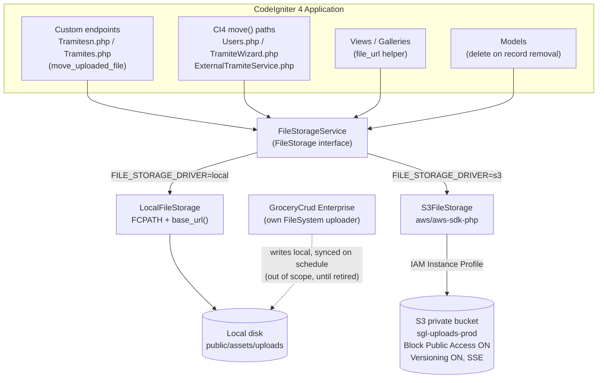
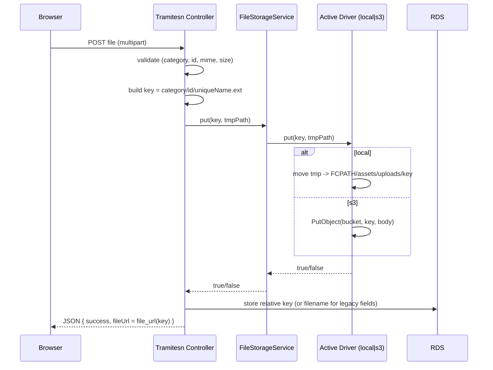
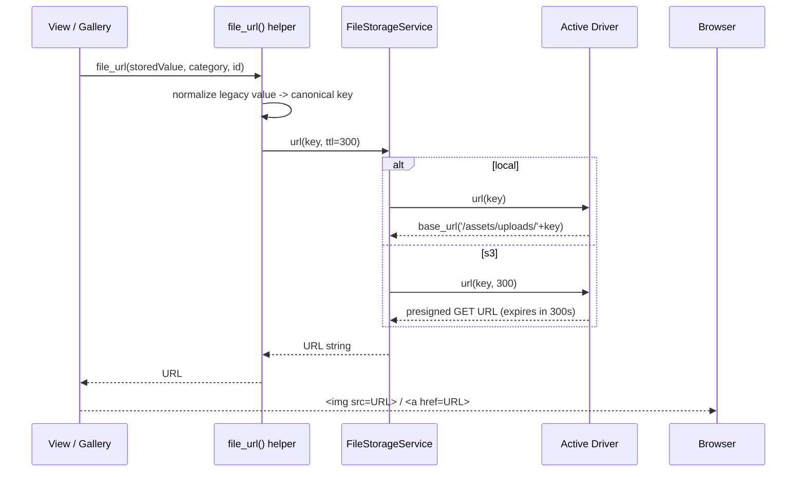
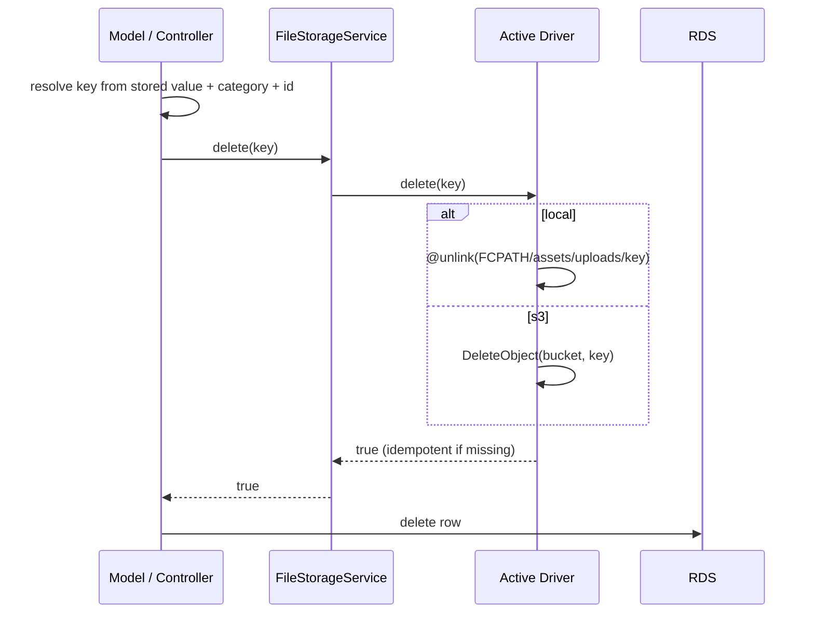

# Design Document: S3 File Storage Abstraction & Non-Destructive Migration

## Overview

This feature introduces a **storage abstraction layer** (`FileStorageService`) into the CodeIgniter 4 application so that uploaded documents and images can be persisted on **Amazon S3** instead of the local EC2 disk, while preserving today's exact behavior when running in `local` mode. The layer exposes two swappable drivers — `LocalFileStorage` (current `FCPATH` + `base_url()` behavior) and `S3FileStorage` (private bucket, presigned URLs, IAM Instance Profile credentials) — selected at runtime via a single `.env` flag (`FILE_STORAGE_DRIVER=local|s3`).

The primary goal is to make the application **stateless** with respect to files, which is the prerequisite for scaling the compute tier (a later phase covered separately in `INFRA_AWS_S3_MIGRACION.md`). To get there, existing files are copied to S3 through a **one-time, non-destructive migration** (`aws s3 sync` **without** `--delete`, additive only), with an integrity check (local file count vs S3 object count) and the local disk preserved as a backup. Bucket versioning is ON so any overwrite is recoverable.

This design follows `INFRA_AWS_S3_MIGRACION.md` (§4.1–§4.6) as the source of truth. It addresses the two directly-controllable upload mechanisms — the custom `move_uploaded_file()` endpoints (`Tramitesn.php`, `Tramites.php`) and the CI4 `$file->move()` paths (`Users.php`, `TramiteWizard.php`, `ExternalTramiteService.php`) — and centralizes URL resolution and deletion. GroceryCrud Enterprise's own uploader is treated as the special case: it keeps writing locally and its prefixes are synced to S3 on a schedule until GroceryCrud is retired (see `PLAN_SALIDA_GROCERYCRUD.md`), so it does not block this work.

**In scope:** the storage service and both drivers, `.env` + `Config\FileStorage` wiring, a URL-resolution helper, key-derivation from existing paths, storing relative keys in the DB with backward-compatible reading of legacy rows, the non-destructive migration procedure, and an optional temporary dual-write window.

**Out of scope (mentioned as related/future only):** deep GroceryCrud S3 integration (sync-until-retired instead), session externalization to Redis (the remaining statelessness blocker per §10.0), CloudFront/OAC, autoscaling, EC2 migration, and Terraform.

---

## Architecture

The application code never talks to the filesystem or the AWS SDK directly. All writes, deletes, URL generation, and existence checks flow through `FileStorageService`, which delegates to the active driver chosen by configuration.



**Key architectural decisions (from `INFRA_AWS_S3_MIGRACION.md`):**

- **Single switch, two drivers.** `FILE_STORAGE_DRIVER` flips the entire app between local and S3 with no code changes and no data changes, because the DB stores relative keys, not URLs (§4.3).
- **Private bucket + presigned URLs.** Documents are sensitive (invoices, acknowledgements, evidence). The bucket has Block Public Access ON; sensitive files are served via short-lived presigned URLs (TTL ~5 min) generated at render time (§4.5). No PHP streaming proxy (avoids re-coupling CPU to the EC2).
- **IAM Instance Profile credentials.** The AWS SDK reads temporary credentials from the EC2 metadata endpoint. No access keys in `.env` or the repository (§4.2, §9).
- **Relative key is the source of truth in the DB.** e.g. `pago_gestor/12472/abc.jpg`. The full URL is resolved at render time, so the driver/bucket/CDN can change without touching data (§4.3 Nota).
- **Non-destructive migration.** `aws s3 sync` without `--delete`; local disk preserved; versioning ON (§4.6).

---

## Sequence Diagrams

### Upload flow (custom endpoint, e.g. `upload_step1_doc`)



### Serve / render flow (gallery)



### Delete flow (record removal)



### Migration flow (one-time, non-destructive)

```mermaid
sequenceDiagram
    participant Op as Operator (DevOps)
    participant EC2 as EC2 (local disk)
    participant S3 as S3 bucket (versioning ON)
    participant App as Application

    Note over App: driver still = local (no downtime)
    Op->>S3: aws s3 sync ./public/assets/uploads s3://bucket (NO --delete)
    Note over Op,S3: additive copy; local files untouched
    opt dual-write window
        App->>App: put() writes local AND s3 (temp flag)
    end
    Op->>S3: aws s3 sync ... (incremental, --size-only)
    Op->>EC2: find ... -type f | wc -l
    Op->>S3: aws s3 ls --recursive | wc -l
    Note over Op: counts must match (integrity check)
    Op->>App: set FILE_STORAGE_DRIVER=s3 (read flip)
    Op->>App: verify galleries/preview in steps 1-5
    Note over EC2: local disk preserved as backup (never deleted)
```

---

## Components and Interfaces

### Component 1: `FileStorage` (interface)

**Purpose**: The storage contract. All drivers implement it; all app code depends only on it.

**Interface** (matches `INFRA_AWS_S3_MIGRACION.md` §4.3, minimum surface):

```php
<?php
namespace App\Libraries\Storage;

interface FileStorage
{
    /**
     * Persist the file at $localTmpPath under $key.
     * @param string $key         Relative key, e.g. "pago_gestor/12472/abc.jpg"
     * @param string $localTmpPath Absolute path to a readable temp file (e.g. $_FILES tmp_name)
     * @return bool  true on success
     */
    public function put(string $key, string $localTmpPath): bool;

    /** Remove the object at $key. Idempotent: returns true if already absent. */
    public function delete(string $key): bool;

    /**
     * Resolve a browser-usable URL for $key.
     * local: base_url('/assets/uploads/'.$key). s3: presigned GET valid for $ttlSeconds.
     */
    public function url(string $key, int $ttlSeconds = 300): string;

    /** True if an object exists at $key. */
    public function exists(string $key): bool;
}
```

**Responsibilities**:
- Define the single, stable contract for all storage operations.
- Keep the app decoupled from `FCPATH`/`base_url()` and from the AWS SDK.

### Component 2: `FileStorageService` (facade / factory)

**Purpose**: Resolve and cache the active driver from configuration, and expose it to callers. Registered as a shared service in `Config\Services` so callers do `service('fileStorage')`.

**Interface**:

```php
<?php
namespace App\Libraries\Storage;

use Config\FileStorage as FileStorageConfig;

final class FileStorageService implements FileStorage
{
    private FileStorage $driver;

    public function __construct(FileStorageConfig $config)
    {
        $this->driver = ($config->driver === 's3')
            ? new S3FileStorage($config)
            : new LocalFileStorage($config);
    }

    public function put(string $key, string $localTmpPath): bool { return $this->driver->put($key, $localTmpPath); }
    public function delete(string $key): bool                    { return $this->driver->delete($key); }
    public function url(string $key, int $ttlSeconds = 300): string { return $this->driver->url($key, $ttlSeconds); }
    public function exists(string $key): bool                    { return $this->driver->exists($key); }
}
```

**Responsibilities**:
- Select the driver from `Config\FileStorage->driver`.
- Provide a single shared instance (via `Services`) so the SDK client is built once per request.

### Component 3: `LocalFileStorage`

**Purpose**: Reproduce today's exact behavior so `local` mode is behavior-identical to the current system.

**Responsibilities**:
- `put`: `move_uploaded_file()` when the source is an HTTP upload, else `rename()`/`copy()`; create the target directory (mirroring current `mkdir(..., 0777, true)`).
- `url`: return `base_url('/assets/uploads/' . $key)` (rawurlencoded per segment).
- `delete`: `@unlink(FCPATH . 'assets/uploads/' . $key)`, idempotent.
- `exists`: `is_file(...)`.
- Guard against path traversal (reject keys containing `..`).

### Component 4: `S3FileStorage`

**Purpose**: Persist to a private S3 bucket and serve via presigned URLs, using Instance Profile credentials.

**Responsibilities**:
- Build an `Aws\S3\S3Client` from region only (SDK resolves credentials from the Instance Profile metadata endpoint — no keys).
- `put`: `PutObject` with `Bucket`, `Key`, `SourceFile` (or `Body` stream), server-side encryption header.
- `url`: create a presigned `GetObject` command with `+{ttl} seconds` expiry.
- `delete`: `DeleteObject` (idempotent — S3 returns success even if the key is absent).
- `exists`: `doesObjectExist($bucket, $key)`.

### Component 5: URL helper `file_url()`

**Purpose**: Single call site for views/galleries/JSON responses that currently build `base_url('/assets/uploads/...')`. Normalizes legacy stored values to a canonical key, then delegates to the service.

**Interface**:

```php
/**
 * Resolve a browser URL for a stored file value.
 * @param string   $storedValue Raw DB value: may be a bare filename (legacy) or a relative key.
 * @param string   $category    e.g. "documentostatus", "pago_gestor" (used to rebuild legacy keys).
 * @param int|null $id          tramite id for per-id categories (pago_gestor/pago_derechos/cobro_cliente).
 * @param int      $ttl         presigned TTL when driver=s3.
 * @return string  '' when $storedValue is empty.
 */
function file_url(string $storedValue, string $category = '', ?int $id = null, int $ttl = 300): string;
```

### Component 6: Migration command `s3:migrate-check` (CLI)

**Purpose**: A `spark` command wrapping the integrity verification of §4.6 (count local files vs S3 objects, report drift). The `aws s3 sync` copy itself is run by the operator on the CLI; the command automates the count/verify step and can optionally emit a per-key existence report.

---

## Data Models

The feature changes **what value is stored**, not the schema. Columns stay as-is (`file`, `foto`, etc. are already string columns); the intent moves from "bare filename / absolute URL" to "relative key".

### Model: Stored file reference (conceptual)

```php
// Canonical form going forward (stored in DB string columns):
//   "<category>/<id?>/<uniqueName>.<ext>"
// Examples:
//   "pago_gestor/12472/comprobante_12472_abc123.jpg"
//   "documentostatus/documento_5001_11_abc123.pdf"
```

**Field intent by category (grounded in current code):**

| Category | Current DB value | On-disk path today | Canonical key going forward |
|---|---|---|---|
| `documentostatus` (`tra_doc_status.file`) | **bare filename** | `assets/uploads/documentostatus/<file>` | `documentostatus/<file>` |
| `pago_gestor` | bare filename (folder by id) | `assets/uploads/pago_gestor/<id>/<file>` | `pago_gestor/<id>/<file>` |
| `pago_derechos` | bare filename (folder by id) | `assets/uploads/pago_derechos/<id>/<file>` | `pago_derechos/<id>/<file>` |
| `cobro_cliente` (`tra_cobro_cliente.file`) | bare filename (folder by id) | `assets/uploads/cobro_cliente/<id>/<file>` | `cobro_cliente/<id>/<file>` |
| `evidencias` | bare filename | `assets/uploads/evidencias/<file>` | `evidencias/<file>` |
| `avatars` | bare filename | `assets/uploads/avatars/<file>` | `avatars/<file>` |
| external API (`tra_doc_status`) | bare filename | `WRITEPATH/uploads/tramites/<id>/<file>` | `tramites/<id>/<file>` |

**Validation rules (key format):**
- Non-empty; no leading `/`; no `..` segments; no backslashes.
- Matches `^[a-zA-Z0-9._\-]+(/[a-zA-Z0-9._\-]+)*$`.
- For per-id categories, the second segment is the numeric id.

### Backward compatibility (reading legacy rows)

Because most columns store a **bare filename** today (not a key), reading must normalize on the fly. The `file_url()` helper and delete paths run values through a `keyFromStored()` normalizer:

```
IF storedValue already looks like a relative key (contains '/', no scheme)
    -> use as-is
ELSE IF storedValue is an absolute URL (starts http:// or https://)
    -> strip origin + '/assets/uploads/' prefix -> remaining = key
ELSE (bare filename)
    -> rebuild key = category [+ '/' + id] + '/' + filename
```

This means **no data backfill is required** for the read path: legacy filenames resolve correctly against S3 because the migration preserved the same prefix layout (`assets/uploads/<category>/...` → `<category>/...`). An optional normalization script (Risk §9 of the infra doc: "URLs viejas guardadas como absolutas") can rewrite any rows that stored absolute URLs, but it is not required for correctness.

---

## Algorithmic Pseudocode

### Algorithm: Build a storage key from an upload

```pascal
ALGORITHM buildKey(category, id, originalName)
INPUT:  category (String), id (Int or NULL), originalName (String)
OUTPUT: key (String)

BEGIN
  ext      <- lowercase(extension(originalName))
  baseName <- filenameWithoutExt(originalName)
  safeBase <- regexReplace(baseName, "[^a-zA-Z0-9_-]+", "_")
  safeBase <- trim(safeBase, "_")
  IF safeBase = "" THEN safeBase <- "documento" END IF

  TRY
    random <- hex(randomBytes(8))
  CATCH
    random <- uniqid()
  END TRY

  fileName <- safeBase + "_" + str(id) + "_" + random
  IF ext <> "" THEN fileName <- fileName + "." + ext END IF

  IF id <> NULL THEN
    key <- category + "/" + str(id) + "/" + fileName
  ELSE
    key <- category + "/" + fileName
  END IF

  ASSERT matches(key, "^[A-Za-z0-9._-]+(/[A-Za-z0-9._-]+)*$")
  RETURN key
END
```

**Preconditions:** `category` is a known non-empty category; `originalName` is the client-supplied filename.
**Postconditions:** returns a traversal-safe relative key; uniqueness comes from the random suffix.
**Loop invariants:** N/A.

### Algorithm: Upload integration (replaces `move_uploaded_file` block)

```pascal
ALGORITHM handleUpload(request, category, id)
INPUT:  request with $_FILES['file'], category, id
OUTPUT: JSON response

BEGIN
  IF $_FILES['file'] empty OR tmp_name empty THEN
    RETURN error(400, "No se recibió ningún archivo")
  END IF

  ASSERT validateMime(file) AND validateSize(file)   // unchanged from today

  key     <- buildKey(category, id, file.name)
  storage <- service('fileStorage')

  ok <- storage.put(key, file.tmp_name)              // replaces move_uploaded_file
  IF NOT ok THEN
    RETURN error(500, "No se pudo guardar el archivo")
  END IF

  TRY
    // store canonical value: bare filename for legacy fields, key otherwise
    storedValue <- storedFormFor(category, key)
    db.insertOrReplace(row with file = storedValue)
  CATCH e
    storage.delete(key)                               // compensating action
    RETURN error(500, "Error al guardar el documento")
  END TRY

  RETURN success({ fileName: basename(key),
                   filePath: file_url(storedValue, category, id) })
END
```

**Preconditions:** request authenticated; `category`/`id` validated against the tramite.
**Postconditions:** on success the object exists in the active store AND a DB row references it; on DB failure the just-written object is removed (no orphan). Local disk contents from before this call are never mutated except the explicit legacy-replace unlink already present today.
**Loop invariants:** when replacing prior active rows, all already-processed prior files have been unlinked/deleted before the new row is inserted.

### Algorithm: Resolve URL with legacy normalization

```pascal
ALGORITHM file_url(storedValue, category, id, ttl)
BEGIN
  IF storedValue = "" THEN RETURN "" END IF
  key <- keyFromStored(storedValue, category, id)
  RETURN service('fileStorage').url(key, ttl)
END

ALGORITHM keyFromStored(storedValue, category, id)
BEGIN
  IF startsWith(storedValue, "http://") OR startsWith(storedValue, "https://") THEN
    p <- pathAfter(storedValue, "/assets/uploads/")
    RETURN p                          // already category/.../file
  ELSE IF contains(storedValue, "/") THEN
    RETURN ltrim(storedValue, "/")    // already a relative key
  ELSE
    // bare filename (the common legacy case)
    IF id <> NULL THEN
      RETURN category + "/" + str(id) + "/" + storedValue
    ELSE
      RETURN category + "/" + storedValue
    END IF
  END IF
END
```

**Preconditions:** `category` (and `id` for per-id categories) provided for bare-filename values.
**Postconditions:** returns a canonical key usable by either driver; empty input yields empty output (safe for optional fields).

### Algorithm: `S3FileStorage.url` (presigned)

```pascal
ALGORITHM s3Url(key, ttl)
BEGIN
  cmd     <- s3Client.getCommand("GetObject", { Bucket: BUCKET, Key: key })
  request <- s3Client.createPresignedRequest(cmd, "+" + str(ttl) + " seconds")
  RETURN (string) request.getUri()
END
```

**Preconditions:** SDK client built; Instance Profile grants `s3:GetObject` on `arn:.../BUCKET/*`.
**Postconditions:** returns a time-limited URL valid for `ttl` seconds; no object contents read server-side.

### Algorithm: Migration integrity check (`s3:migrate-check`)

```pascal
ALGORITHM migrateCheck(localRoot, bucket)
BEGIN
  localCount <- countFiles(localRoot, excludePattern="*.tmp")
  s3Count    <- countObjects(bucket)          // aws s3 ls --recursive | wc -l
  drift      <- localCount - s3Count

  PRINT "local:", localCount, " s3:", s3Count, " drift:", drift
  IF drift <= 0 THEN
    RETURN OK          // every local file has an S3 counterpart
  ELSE
    RETURN WARN(drift) // objects still missing in S3; re-run incremental sync
  END IF
END
```

**Preconditions:** initial `aws s3 sync` (without `--delete`) has run.
**Postconditions:** reports whether S3 covers all local files; never deletes anything.
**Loop invariants:** counting is read-only over both stores.

---

## Key Functions with Formal Specifications

### `LocalFileStorage::put(string $key, string $localTmpPath): bool`
- **Preconditions:** `$localTmpPath` is readable; `$key` passes the key-format assertion.
- **Postconditions:** file exists at `FCPATH.'assets/uploads/'.$key`; parent dirs created; returns `false` (no partial state visible) if the move fails.
- **Loop invariants:** N/A.

### `S3FileStorage::put(string $key, string $localTmpPath): bool`
- **Preconditions:** SDK client available; Instance Profile grants `s3:PutObject`.
- **Postconditions:** object stored at `s3://BUCKET/$key` with SSE; returns `false` on SDK exception (caller compensates). Versioning ON means an overwrite creates a new version rather than losing the prior one.
- **Loop invariants:** N/A.

### `FileStorage::delete(string $key): bool`
- **Preconditions:** `$key` normalized.
- **Postconditions:** no object exists at `$key` afterward; idempotent (returns `true` if it was already absent). Never touches keys other than `$key`.
- **Loop invariants:** N/A.

### `FileStorage::url(string $key, int $ttl): string`
- **Preconditions:** `$key` normalized; `$ttl > 0` for s3.
- **Postconditions:** returns a non-empty browser-usable URL; for s3 the URL expires after `$ttl` seconds; pure (no writes).
- **Loop invariants:** N/A.

---

## Example Usage

### Config wiring — `.env`

```dotenv
# local | s3
FILE_STORAGE_DRIVER = s3

# S3 driver settings (no access keys: credentials come from the IAM Instance Profile)
S3_BUCKET = sgl-uploads-prod
S3_REGION = us-east-1

# Optional temporary dual-write during the migration window (writes local AND s3)
FILE_STORAGE_DUAL_WRITE = false
```

### Config class — `app/Config/FileStorage.php`

```php
<?php
namespace Config;

use CodeIgniter\Config\BaseConfig;

class FileStorage extends BaseConfig
{
    public string $driver     = 'local';                 // FILE_STORAGE_DRIVER
    public string $bucket     = '';                       // S3_BUCKET
    public string $region     = 'us-east-1';              // S3_REGION
    public bool   $dualWrite  = false;                    // FILE_STORAGE_DUAL_WRITE
    public int    $presignTtl = 300;                      // default 5 min
    public string $localRoot  = FCPATH . 'assets/uploads';// LocalFileStorage root
    public string $sse        = 'AES256';                 // SSE-S3 (or 'aws:kms')
}
```

### Service registration — `app/Config/Services.php`

```php
public static function fileStorage(bool $getShared = true)
{
    if ($getShared) {
        return static::getSharedInstance('fileStorage');
    }
    return new \App\Libraries\Storage\FileStorageService(config('FileStorage'));
}
```

### AWS SDK client construction (Instance Profile — no keys)

```php
use Aws\S3\S3Client;

$this->client = new S3Client([
    'version' => 'latest',
    'region'  => $config->region,
    // No 'credentials' key: the SDK's default provider chain reads temporary
    // credentials from the EC2 Instance Metadata endpoint (IAM Instance Profile).
]);
```

### S3 driver — put / url / delete / exists

```php
public function put(string $key, string $localTmpPath): bool
{
    $this->assertKey($key);
    try {
        $this->client->putObject([
            'Bucket'               => $this->bucket,
            'Key'                  => $key,
            'SourceFile'           => $localTmpPath,
            'ServerSideEncryption' => $this->sse,
        ]);
        return true;
    } catch (\Throwable $e) {
        log_message('error', 'S3 put failed for ' . $key . ': ' . $e->getMessage());
        return false;
    }
}

public function url(string $key, int $ttlSeconds = 300): string
{
    $cmd = $this->client->getCommand('GetObject', [
        'Bucket' => $this->bucket,
        'Key'    => $key,
    ]);
    return (string) $this->client
        ->createPresignedRequest($cmd, '+' . $ttlSeconds . ' seconds')
        ->getUri();
}

public function delete(string $key): bool
{
    try { $this->client->deleteObject(['Bucket' => $this->bucket, 'Key' => $key]); return true; }
    catch (\Throwable $e) { log_message('error', 'S3 delete failed: ' . $e->getMessage()); return false; }
}

public function exists(string $key): bool
{
    return $this->client->doesObjectExist($this->bucket, $key);
}
```

### Call-site replacement in a controller (before → after)

```php
// BEFORE (Tramitesn.php upload_step1_doc)
$targetFile = FCPATH . 'assets/uploads/documentostatus/' . $fileName;
if (!move_uploaded_file($tempFile, $targetFile)) { /* 500 */ }
// ... store $fileName ; return base_url('/assets/uploads/documentostatus/' . rawurlencode($fileName))

// AFTER
$key     = 'documentostatus/' . $fileName;         // buildKey() result
$storage = service('fileStorage');
if (!$storage->put($key, $tempFile)) { /* 500 */ }
// ... store $fileName (legacy bare-filename field kept) ; return file_url($fileName, 'documentostatus');
```

### View / gallery usage

```php
// BEFORE
$url = base_url('assets/uploads/pago_gestor/' . $tramiteId . '/' . $fileName);
// AFTER (presigned when driver=s3, base_url when local)
$url = file_url($fileName, 'pago_gestor', $tramiteId);
```

### CI4 `$file->move()` path (e.g. ExternalTramiteService)

```php
// BEFORE: $archivo->move($uploadPath, $nuevoNombre);
// AFTER:
$key = 'tramites/' . $tramiteId . '/' . $nuevoNombre;
service('fileStorage')->put($key, $archivo->getTempName());
// store $nuevoNombre (bare) or $key per field convention
```

### Migration commands (operator CLI — §4.6)

```bash
# 1. Initial additive copy (app still reading local, no downtime). NEVER use --delete.
aws s3 sync ./public/assets/uploads s3://sgl-uploads-prod --exclude "*.tmp" --size-only

# 3. Incremental final sync (only differences)
aws s3 sync ./public/assets/uploads s3://sgl-uploads-prod --size-only

# 4. Integrity verification (counts must match)
find ./public/assets/uploads -type f | wc -l
aws s3 ls s3://sgl-uploads-prod --recursive | wc -l
php spark s3:migrate-check          # automated equivalent + drift report

# 5. Flip read path
#    set FILE_STORAGE_DRIVER=s3 in .env, then verify galleries in steps 1-5
```

---

## Correctness Properties

### Property 1: Driver transparency
For every key `k`, the sequence `put(k, tmp)` then `url(k)` yields a URL that resolves to the uploaded bytes, regardless of `FILE_STORAGE_DRIVER`. ∀ k, driver ∈ {local, s3}: readable(url(k)) after put(k).

**Validates: Requirements 1.4, 1.5**

### Property 2: Round-trip
∀ k: after `put(k, tmp)`, `exists(k) = true`; after `delete(k)`, `exists(k) = false`.

**Validates: Requirements 2.1, 2.2**

### Property 3: Delete idempotence
∀ k: `delete(k)` returns `true` whether or not `k` existed, and never affects any key ≠ k.

**Validates: Requirements 2.3, 2.4**

### Property 4: Key safety
∀ produced key k: k matches `^[A-Za-z0-9._-]+(/[A-Za-z0-9._-]+)*$` and contains no `..` segment (no path traversal, valid S3 key).

**Validates: Requirements 3.1, 3.2, 3.3, 3.4, 3.5**

### Property 5: Backward-compatible read
∀ legacy stored value v (bare filename, relative key, or absolute URL) with its `category`/`id`: `keyFromStored(v, …)` yields the canonical key whose object was placed by the migration. Empty v ⇒ empty URL.

**Validates: Requirements 4.2, 4.3, 4.4, 4.5, 4.6, 5.1, 5.3**

### Property 6: Non-destructive migration
The migration procedure performs only reads on the local disk and only writes/reads on S3; the count of local files never decreases as a result of migration. localCount(after) = localCount(before).

**Validates: Requirements 8.2, 8.6**

### Property 7: Migration coverage before flip
Before switching to `s3`, ∀ local file f, ∃ S3 object at `keyFromLocalPath(f)` (drift ≤ 0 in `s3:migrate-check`).

**Validates: Requirements 8.3, 8.4, 8.5**

### Property 8: No orphan on failure
If the DB write fails after a successful `put`, the just-written object is removed (compensating `delete`), so there is no object without a referencing row created by that request.

**Validates: Requirements 7.1**

### Property 9: Presigned expiry
∀ s3 URL u = url(k, ttl): u is valid strictly within `ttl` seconds of issuance and denies access afterward.

**Validates: Requirements 2.5, 10.5**

### Property 10: No secrets in artifacts
The S3 client is constructed without literal credentials; no access key or secret appears in `.env`, config, or repository.

**Validates: Requirements 10.1, 10.2**

---

## Error Handling

### Scenario: `put` fails (disk full / S3 exception)
- **Condition:** `move_uploaded_file`/`rename` returns false, or `PutObject` throws.
- **Response:** driver returns `false`; controller returns HTTP 500 with a user-facing message; error logged with the key.
- **Recovery:** no DB row is written; client may retry. No partial-visible state.

### Scenario: DB write fails after successful `put`
- **Condition:** exception during insert/update after the object was stored.
- **Response:** compensating `delete($key)` runs (mirrors today's `@unlink($targetFile)` in the catch block), then HTTP 500.
- **Recovery:** store and DB remain consistent (no orphaned object).

### Scenario: Missing / expired presigned URL access
- **Condition:** a rendered presigned URL is opened after its TTL.
- **Response:** S3 returns 403 (AccessDenied) to the browser.
- **Recovery:** reloading the gallery regenerates a fresh URL (URLs are computed at render time, never persisted).

### Scenario: Legacy row with absolute URL in DB
- **Condition:** a pre-existing row stored a full `base_url(...)` string.
- **Response:** `keyFromStored` strips the origin and `/assets/uploads/` prefix to recover the key.
- **Recovery:** optional one-off normalization script rewrites such rows to relative keys (not required for correctness).

### Scenario: IAM/metadata credential failure
- **Condition:** Instance Profile not attached or metadata unreachable.
- **Response:** SDK throws on first S3 call; `put`/`delete` return false, `url` surfaces the exception; logged.
- **Recovery:** operational fix (attach Instance Profile). `local` driver remains a fallback via the `.env` flag.

### Scenario: Key with traversal attempt
- **Condition:** a value containing `..` or leading `/` reaches a driver.
- **Response:** `assertKey` throws before any filesystem/S3 operation.
- **Recovery:** request rejected (422/400); logged as suspicious input.

---

## Testing Strategy

### Unit testing approach
- **Driver contract tests** run the same suite against `LocalFileStorage` (using a temp dir / `vfsStream`, already a dev dependency) and `S3FileStorage` (using the AWS SDK `MockHandler`): put→exists→url→delete round-trip, delete idempotence, traversal rejection.
- **`keyFromStored` / `buildKey`** table-driven tests covering bare filename, relative key, absolute URL, per-id vs flat categories, empty input.
- **Compensating delete** test: simulate DB failure after put, assert object removed.

### Property-based testing approach
Focus on the driver-independent invariants above.

**Property test library:** none present today; recommend adding a PHP PBT library (e.g. **Eris**) as a dev dependency, or expressing generators via PHPUnit data providers if a new dependency is undesirable.

Candidate properties to encode:
- Round-trip (Property 2) with random valid keys and payloads against the local driver and the mocked S3 driver.
- Key safety (Property 4): for arbitrary `category`/`originalName`, `buildKey` never yields a traversal or invalid S3 key.
- Backward-compatible read (Property 5): for arbitrary category/id/filename, `keyFromStored(bareFilename)` equals the canonical key, and is a fixed point when applied to its own output.
- Delete idempotence (Property 3): repeated deletes on random keys always return true and leave other keys untouched.

### Integration testing approach
- End-to-end upload → DB → `file_url` render, with `FILE_STORAGE_DRIVER` toggled between `local` and `s3` (LocalStack or a sandbox bucket) to confirm driver transparency (Property 1).
- Migration rehearsal in staging: seed local files, run `aws s3 sync` (no `--delete`), run `s3:migrate-check`, flip to `s3`, verify galleries in steps 1–5, confirm local file count unchanged (Property 6/7).
- Dual-write window test: with `FILE_STORAGE_DUAL_WRITE=true`, a new upload lands in both stores.

---

## Security Considerations

- **Private bucket + Block Public Access ON.** No object is publicly readable; access is only via presigned URLs issued by the app after it has authorized the user (§4.5).
- **Short presigned TTL (~5 min).** Limits the window a leaked URL is usable; URLs are generated at render time and never persisted (Property 9).
- **IAM Instance Profile, least privilege.** Credentials come from instance metadata, never `.env`/repo (Property 10). Policy limited to `s3:GetObject/PutObject/DeleteObject` on `arn:aws:s3:::sgl-uploads-prod/*` and `s3:ListBucket` on the bucket (§4.2).
- **Encryption.** SSE at rest (SSE-S3 default, SSE-KMS optional for key control/audit) and TLS in transit.
- **Versioning ON.** Accidental overwrite/delete is recoverable — reinforces the non-destructive posture.
- **Path-traversal defense.** `assertKey` rejects `..` and absolute keys before any store operation (Property 4).
- **No streaming proxy.** Documents are not proxied through PHP, avoiding both CPU coupling and accidental exposure through app routes.

---

## Performance Considerations

- **Presigned URL generation is local and cheap** (HMAC signing, no network round-trip), so galleries listing many files add negligible latency versus building `base_url()` strings today.
- **Single shared SDK client** per request (via `Services::fileStorage` shared instance) avoids repeated client construction.
- **Uploads** add one S3 `PutObject` round-trip versus a local move; acceptable for the current scale (20 concurrent users, ~10 h/day per the infra doc). Large multi-file steps stream from the temp file (`SourceFile`) rather than loading into memory.
- Optional **CloudFront + OAC** for read-heavy scenarios is noted as future/optional (§4.5) and out of scope here.

---

## Dependencies

- **`aws/aws-sdk-php`** — new runtime dependency (`composer require aws/aws-sdk-php`), PHP 7.2+ compatible per §4.3. Not currently in `composer.json`.
- **CodeIgniter 4** service container, config, and `spark` CLI (existing).
- **`mikey179/vfsstream`** (existing dev dep) for local-driver unit tests; AWS SDK `MockHandler` for S3 unit tests.
- **AWS CLI** on the EC2/operator host for `aws s3 sync` and verification (operational, not a code dependency).
- **IAM Instance Profile** attached to the EC2 with the least-privilege policy (§4.2) — infra prerequisite.
- Optional: a PHP property-based testing library (e.g. **Eris**) as a dev dependency.

---

## Related / Future Concerns (out of scope for this feature)

- **GroceryCrud Enterprise 3.1.7 uploads.** Keep writing locally; sync those prefixes to S3 on a schedule until GroceryCrud is retired (see `PLAN_SALIDA_GROCERYCRUD.md`) — infra doc §4.4 option A. Not designed in detail here.
- **Session externalization to Redis (ElastiCache).** Sessions still use `FileHandler` on local disk — the remaining statelessness blocker for multi-instance (infra doc §10.0). Tracked separately.
- **Compute migration (new EC2, Elastic IP), CloudFront/OAC, autoscaling, Terraform.** Covered by `INFRA_AWS_S3_MIGRACION.md` phases 2–4.
