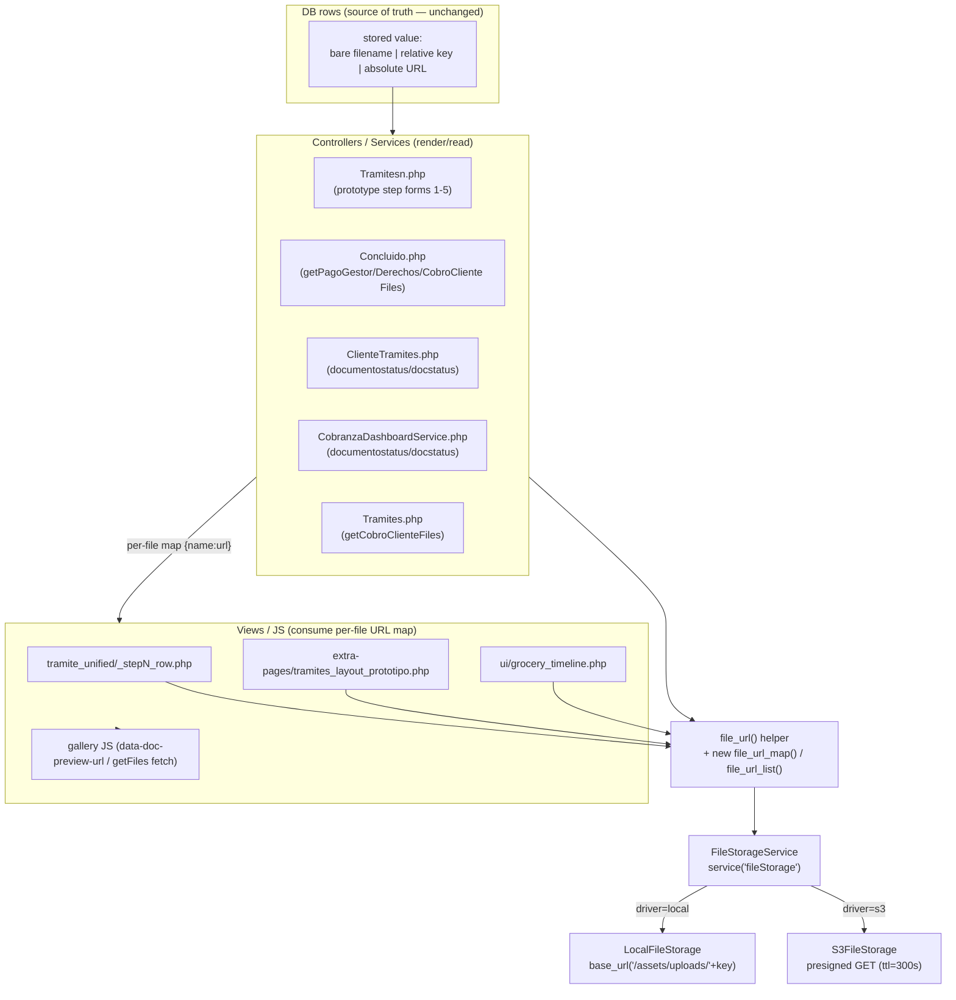
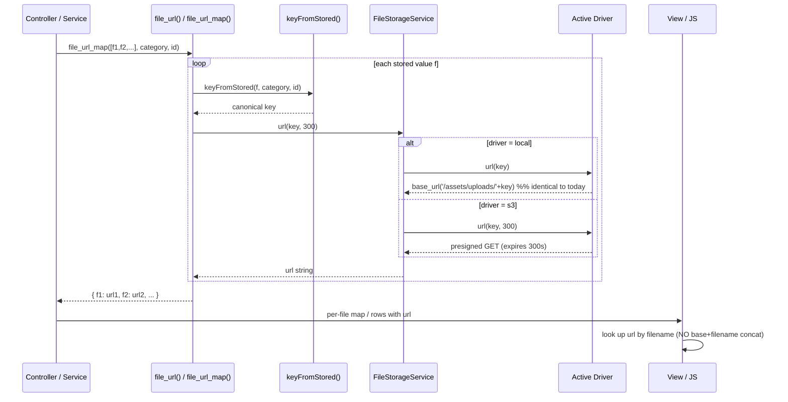

# Design Document: S3 Presigned Render — Migrate Read/Render Call Sites to `file_url`

## Overview

The sibling spec `s3-file-storage` introduced a storage abstraction (`FileStorage` interface, `FileStorageService` via `service('fileStorage')`, `S3FileStorage` and `LocalFileStorage` drivers) and a `file_url(storedValue, category, id, ttl)` helper. The **write/upload path** was migrated to the service, but several **read/render call sites were not**. They still build local URLs by hand (`base_url('/assets/uploads/<category>/<id>/<file>')`) or emit a `fileBaseUrl` that the frontend concatenates with a filename. Both patterns break when `FILE_STORAGE_DRIVER=s3`: the objects are no longer on the local disk, so `/assets/uploads/...` routes to a nonexistent `Assets::uploads` controller and returns 404. The `fileBaseUrl + filename` pattern is fundamentally incompatible with S3 because a presigned URL is **per-object** and signed/expiring — you cannot presign a "base" and let the client append filenames.

This feature eliminates both patterns for the render path by routing **every** rendered file through the existing `file_url()` helper (which returns a presigned URL under `s3` and a `base_url()` path under `local`). It replaces the `fileBaseUrl` contract with a **per-file presigned URL map** emitted by the controller and consumed directly by the views/JS. Stored DB values remain the source of truth and are never modified; `keyFromStored()` continues to normalize legacy bare filenames, relative keys, and absolute URLs.

The design is constrained to be **behavior-identical under `FILE_STORAGE_DRIVER=local`** (the presign helper already returns `base_url()` paths there, so nothing observable changes until s3 is flipped). It targets CodeIgniter 4.0.4 / PHP 8.2, where helpers are loaded via the controller `$helpers` property (`BaseController` already includes `filestorage`). The actual bucket file migration (`aws s3 sync`, `s3:migrate-check`), GroceryCrud's own upload widget internals, and Terraform are out of scope.

---

## High-Level Design

## Architecture

The render path. The application code never builds an upload URL directly. Every rendered file resolves through `file_url()` (or a thin map/list helper built on top of it), which delegates to `FileStorageService` and the active driver. The driver decides whether the browser gets a `base_url()` path (local) or a short-lived presigned GET URL (s3).



**Key architectural decisions:**

- **Single resolution point.** Every rendered file — inline ``/`<a>` in server-rendered views, JSON returned to gallery JS, and per-doc entries in step forms — resolves through `file_url()`. No call site constructs `/assets/uploads/...`.
- **Per-file URL map replaces `fileBaseUrl`.** Because presigned URLs are per-object, the controller resolves each file to its own URL and passes a map `{ storedValue => url }` (or a list `[{name, url}]`) to the view. The view/JS looks up the URL by filename instead of concatenating a base.
- **Render-time resolution, never persisted.** URLs are computed on each render. Under s3 they expire (default TTL 300s); a stale URL is refreshed by reloading the gallery or via the existing `getFiles` AJAX endpoints, which re-resolve on every call.
- **Presign is local/CPU-only.** `createPresignedRequest` performs no network I/O (it signs locally with instance-profile credentials), so resolving many files in a gallery loop is cheap; no per-file round trip. Existence checks (`exists()`) DO hit the network on s3 and are treated separately (see Error Handling).
- **Local mode is a no-op change.** Under `local`, `file_url()` returns exactly the `base_url('/assets/uploads/...')` string these sites build today, so output is byte-identical until s3 is flipped.

### Affected flows inventory

Confirmed by investigation of the codebase. Two incompatible patterns must be eliminated on the read/render path.

#### Pattern A — `fileBaseUrl` emitted by controller, concatenated by view/JS

| Call site | Category / id | Emitted at | Consumed at |
|---|---|---|---|
| `Tramitesn.php` step1 docs form | `documentostatus` (no id) | `fileBaseUrl => base_url('/assets/uploads/documentostatus/')` | `_step1_row.php` (`$docFileBaseUrl`) + `tramites_layout_prototipo.php` |
| `Tramitesn.php` step2 form | `pago_derechos/<id>` | `fileBaseUrl => base_url('/assets/uploads/pago_derechos/'.$id.'/')` | `_step2_row.php` (`rtrim($fileBaseUrl,'/').'/'.rawurlencode($docFile)`) |
| `Tramitesn.php` step3 form | `pago_gestor/<id>` | `fileBaseUrl => base_url('/assets/uploads/pago_gestor/'.$id.'/')` | `_step3_row.php` |
| `Tramitesn.php` step4 form | `pago_gestor/<id>` | `fileBaseUrl => base_url('/assets/uploads/pago_gestor/'.$id.'/')` | `_step4_row.php` + `tramites_layout_prototipo.php` (`data-doc-preview-url`) |
| `Tramitesn.php` step5 form | `cobro_cliente/<id>` | `fileBaseUrl => base_url('/assets/uploads/cobro_cliente/'.$id.'/')` | `_step5_row.php` + `tramites_layout_prototipo.php` |

> Note: **step1 documents already resolve per-doc** via `file_url($fileName, 'documentostatus')` stored on each `documentItem['file_url']` (controller lines ~735, view renders `$fileUrl`). This is the target pattern to generalize to steps 2–5. The step1 `fileBaseUrl` field is now vestigial and should be removed.

#### Pattern B — direct `base_url('/assets/uploads/...')` and local-disk-gated JSON

| Call site | Category / id | Issue |
|---|---|---|
| `Concluido.php::getPagoGestorFiles` | `pago_gestor/<id>` | `existing_path => base_url($filePath)`, image `icon => base_url($filePath)`, gated by `file_exists(FCPATH.$filePath)` |
| `Concluido.php::getPagoDerechosFiles` | `pago_derechos/<id>` | same shape |
| `Concluido.php::getCobroClienteFiles` | `cobro_cliente/<id>` | same shape |
| `Tramites.php::getCobroClienteFiles` | `cobro_cliente/<id>` | same shape |
| `ClienteTramites.php` `resolveDocUrl` | `documentostatus`, `docstatus` | candidate dirs + `base_url($cand['url'].$fileBase)`, gated by `is_file()` |
| `CobranzaDashboardService.php` | `documentostatus`, `docstatus` | candidate dir/url arrays (same shape) |
| `ui/grocery_timeline.php` | bare `assets/uploads/<file>` | inline `base_url().'/assets/uploads/'.$val_image` + `file_exists()` |

The `file_exists()` / `is_file()` gate is the subtle behavioral trap: under `s3` the object is not on the local disk, so a naive port would filter every row out and render empty galleries. See Error Handling → *Local-disk existence gate*.

#### Explicitly out of scope (write widgets, not render)

`setFieldUploadMultiple(...)` / `setFieldUpload(...)` calls in `Customers.php`, `Users.php`, `Tradocstatus.php`, `Concluido.php`, `Tramitesn.php` are GroceryCrud's own uploader configuration (write path), covered by the sync-until-retired decision in `s3-file-storage`. `TraCobroClienteModel.php`'s `@unlink(FCPATH...)` is a delete path, also out of scope here.

## Components and Interfaces

### New controller → frontend contract (per-file presigned URL map)

The `fileBaseUrl` string is replaced by resolved per-file URLs. Two equivalent shapes are used depending on the consumer:

**Shape 1 — server-rendered step forms (steps 2–5):** each doc row already carries a `file`; the controller adds a resolved `url` (and for images an `icon`) to each raw doc entry, and drops `fileBaseUrl`.

```php
// BEFORE (step5 docs_raw): [ ['id'=>7,'file'=>'a.jpg','cobro_correcto'=>'completo'], ... ]
// plus form['fileBaseUrl'] = base_url('/assets/uploads/cobro_cliente/123/')

// AFTER: fileBaseUrl removed; each row self-describes its URL
[
  ['id' => 7, 'file' => 'a.jpg', 'cobro_correcto' => 'completo',
   'url' => 'https://bucket.s3...&X-Amz-Signature=...',  // or base_url path under local
   'is_image' => true],
]
```

**Shape 2 — `getFiles` AJAX endpoints (JSON):** the `existing_path` and image `icon` fields are resolved through `file_url()` instead of `base_url($localPath)`. The response array keeps its existing keys so the consuming JS needs no change beyond already reading `existing_path`.

```jsonc
// GET /deskapp/tramitesn/getCobroClienteFiles/123  -> 200
[
  { "id": 7, "name": "a.jpg", "size": 20481,
    "existing_path": "https://bucket.s3...&X-Amz-Signature=...", // was base_url('assets/uploads/...')
    "icon": "https://bucket.s3...&X-Amz-Signature=...",          // image: presigned; non-image: static icon path (unchanged)
    "cobro_correcto": "completo" }
]
```

The frontend change is minimal: views stop concatenating `fileBaseUrl + filename` and instead read the pre-resolved `url` (server-rendered) or `existing_path` (AJAX). A convenience helper `file_url_map()` lets a view resolve a list of stored values into a `{ name => url }` lookup where a map is more natural than mutating each row.

## Data Models

The feature changes **what is passed to views/JS**, not any DB schema. DB columns (`file`, etc.) are untouched; stored values remain the source of truth.

### Model: Resolved document row (server-rendered steps 2–5)

```php
// Enriched from the existing *_docs_raw rows; adds resolved URL + image flag.
[
  'id'               => int,     // (present for cobro_cliente rows; optional otherwise)
  'file'             => string,  // stored value (unchanged source of truth)
  'comprobante_final'=> string,  // or 'cobro_correcto' — existing type field, unchanged
  'url'              => string,  // = file_url(file, category, id): presigned (s3) | base_url path (local) | ''
  'is_image'         => bool,    // = is_image_filename(file)
]
```
**Validation rules:** `url` is either a non-empty resolved URL or `''` (never a hand-built `/assets/uploads/...`); `file` is echoed verbatim from the DB; `is_image` is derived purely from the extension.

### Model: Per-file URL map (`file_url_map`)

```php
// array<string,string> keyed by the ORIGINAL stored value
[ 'a.jpg' => 'https://bucket...sig', 'b.pdf' => 'https://bucket...sig' ]
```
**Validation rules:** keys are distinct non-empty stored values; each value equals `file_url(key, category, id)`; empty/whitespace inputs are excluded.

### Model: `getFiles` JSON entry (AJAX)

```php
[
  'id'            => int,
  'name'          => string,   // stored filename (unchanged)
  'size'          => int|null,  // present under local only (filesize); omitted under s3
  'existing_path' => string,   // = file_url(name, category, id)
  'icon'          => string,   // image: same resolved URL; non-image: static icon path (unchanged)
  '<typeField>'   => string,   // e.g. cobro_correcto (unchanged)
]
```
**Validation rules:** `existing_path` is always a `file_url()` result; under `s3` it is presigned and never a local upload path; the array preserves the existing key names so current consumers keep working.

### Data flow for both drivers



---

## Low-Level Design

Language: **PHP 8.2 / CodeIgniter 4.0.4** (explicitly the project stack). All new code lives in the existing `app/Helpers/filestorage_helper.php` and the affected controllers/views. No new classes are required.

### New helper additions (`app/Helpers/filestorage_helper.php`)

Two thin helpers built on the existing `file_url()`. They add no new resolution logic — they map/iterate over `file_url()` so every rendered URL still flows through the single resolution point and inherits its graceful-degradation (empty/unresolvable → `''`).

```php
/**
 * Resolve a list of stored file values into a { storedValue => url } map.
 *
 * Each value is resolved via file_url(); unresolvable/empty values map to ''.
 * Keys are the ORIGINAL stored values (as they appear in the doc rows / DB),
 * so a view can look up the URL by the same filename it already renders.
 *
 * @param string[] $storedValues Raw DB values (bare filename, relative key, or absolute URL).
 * @param string   $category     e.g. "cobro_cliente", "pago_gestor", "documentostatus".
 * @param int|null $id           Tramite id for per-id categories.
 * @param int      $ttl          Presigned TTL (seconds) when driver=s3.
 * @return array<string,string>  Map of storedValue => browser URL ('' when unresolvable).
 */
function file_url_map(array $storedValues, string $category = '', ?int $id = null, int $ttl = 300): array;

/**
 * Resolve a list of stored file values into a list of [name, url] entries,
 * preserving input order and skipping empty names. Convenience for galleries
 * that render an ordered list rather than a keyed lookup.
 *
 * @return array<int,array{name:string,url:string}>
 */
function file_url_list(array $storedValues, string $category = '', ?int $id = null, int $ttl = 300): array;
```

#### Reference implementation

```php
if (!function_exists('file_url_map')) {
    function file_url_map(array $storedValues, string $category = '', ?int $id = null, int $ttl = 300): array
    {
        $map = [];
        foreach ($storedValues as $value) {
            $name = trim((string) $value);
            if ($name === '' || array_key_exists($name, $map)) {
                continue;
            }
            $map[$name] = file_url($name, $category, $id, $ttl); // '' if unresolvable
        }
        return $map;
    }
}

if (!function_exists('file_url_list')) {
    function file_url_list(array $storedValues, string $category = '', ?int $id = null, int $ttl = 300): array
    {
        $list = [];
        foreach ($storedValues as $value) {
            $name = trim((string) $value);
            if ($name === '') {
                continue;
            }
            $list[] = ['name' => $name, 'url' => file_url($name, $category, $id, $ttl)];
        }
        return $list;
    }
}
```

**Preconditions:** `filestorage` helper loaded (already via `BaseController::$helpers`); `category`/`id` valid for the category (per-id categories require a positive `id`).
**Postconditions:** returns an array of the same logical cardinality as the distinct non-empty inputs; every value is the output of `file_url()` (a presigned URL under s3, a `base_url()` path under local, or `''`). Pure w.r.t. the DB (no writes). No entry is ever a hand-built `/assets/uploads/...` string.
**Loop invariants:** after processing the k-th input, `map`/`list` contains exactly the resolved URLs of the first k distinct non-empty inputs, each equal to `file_url(value, …)`.

### Image detection helper (shared, optional)

The `getFiles` endpoints and step forms both decide image-vs-icon. Extract the existing inline logic to keep it consistent:

```php
/** True when the filename extension is a browser-renderable image. */
function is_image_filename(string $name): bool
{
    return (bool) preg_match('/\.(png|jpe?g|gif|webp|bmp|svg)$/i', trim($name));
}
```

### Pseudocode — replacing each `fileBaseUrl` site (steps 2–5)

Controller side (Tramitesn.php prototype form builders). The `fileBaseUrl` key is removed; each raw doc row is enriched with its resolved `url`.

```pascal
ALGORITHM buildStepDocsForm(docsRaw, category, tramiteId)
INPUT:  docsRaw (list of { file, ...meta }), category, tramiteId
OUTPUT: docsResolved (list of { file, ...meta, url, is_image })

BEGIN
  docsResolved <- []
  FOR each row IN docsRaw DO
    fileName <- trim(row.file)
    IF fileName = "" THEN
      url <- ""
    ELSE
      // per-id categories pass tramiteId; documentostatus passes null id
      url <- file_url(fileName, category, idFor(category, tramiteId))
    END IF
    row.url      <- url
    row.is_image <- is_image_filename(fileName)
    docsResolved.append(row)
  END FOR
  RETURN docsResolved      // NOTE: form no longer carries 'fileBaseUrl'
END
```

**Preconditions:** `docsRaw` rows already loaded from DB (as they are today); `category` is one of `{documentostatus, pago_derechos, pago_gestor, cobro_cliente, evidencias}`.
**Postconditions:** every non-empty `row.file` has a `row.url` equal to `file_url(row.file, category, id)`; empty files yield `url=''`; `fileBaseUrl` is absent from the form payload.
**Loop invariants:** all already-processed rows carry a `url` produced solely by `file_url()`.

View side (each `_stepN_row.php` and the mirrored blocks in `tramites_layout_prototipo.php`):

```pascal
// BEFORE
docUrl <- (fileBaseUrl <> "" AND docFile <> "")
            ? rtrim(fileBaseUrl,'/') + '/' + rawurlencode(docFile)
            : '#'

// AFTER — consume the pre-resolved url; no base+filename concatenation
docUrl <- (doc.url <> "") ? doc.url : '#'
```

### Pseudocode — replacing each direct `base_url('/assets/uploads/...')` site

#### `getFiles` AJAX endpoints (Concluido.php ×3, Tramites.php ×1)

```pascal
ALGORITHM getFilesEndpoint(id, category, table)
INPUT:  id, category ∈ {pago_gestor, pago_derechos, cobro_cliente}, table
OUTPUT: JSON list of { id, name, size?, existing_path, icon, ...typeField }

BEGIN
  assertAccess(id)                        // unchanged ACL guards
  rows   <- db.table(table).where(tramite_id=id).get()
  driver <- config('FileStorage').driver
  result <- []

  FOR each dbFile IN rows DO
    name <- dbFile.file
    IF name = "" THEN CONTINUE END IF

    // Local-disk existence gate ONLY under local (preserve today's behavior);
    // under s3 the object is not on local disk, so do not gate on is_file().
    IF driver = "local" THEN
      absolute <- FCPATH + "assets/uploads/" + category + "/" + id + "/" + name
      IF NOT file_exists(absolute) THEN CONTINUE END IF
      size <- filesize(absolute)
    ELSE
      size <- NULL                        // avoid HEAD round trip per file
    END IF

    url <- file_url(name, category, id)    // presigned (s3) or base_url path (local)
    obj <- { id: dbFile.id, name: name, existing_path: url }
    IF size <> NULL THEN obj.size <- size END IF
    obj.icon <- is_image_filename(name) ? url : staticIconFor(extension(name))
    obj.<typeField> <- dbFile.<typeField>  // e.g. cobro_correcto (unchanged)
    result.append(obj)
  END FOR

  RETURN json(result)
END
```

**Preconditions:** ACL guards pass (unchanged); `category`/`id` valid.
**Postconditions:** under `local`, output is identical to today (same gating, same `size`, `existing_path = base_url(localPath)`); under `s3`, `existing_path`/image `icon` are presigned URLs and rows are not filtered out by a local-disk check. `existing_path` never points at `/assets/uploads/...` when `driver=s3`.
**Loop invariants:** every appended `obj.existing_path` equals `file_url(name, category, id)`.

#### `ClienteTramites.php::resolveDocUrl` and `CobranzaDashboardService.php`

```pascal
ALGORITHM resolveDocUrl(fileName)          // documentostatus / docstatus
INPUT:  fileName (may contain a path)
OUTPUT: url (String) or null

BEGIN
  base <- basename(fileName)
  IF base ∈ {"", ".", ".."} OR containsNull(base) OR contains(base, "..") THEN
    RETURN null
  END IF

  driver <- config('FileStorage').driver
  IF driver = "local" THEN
    // preserve today's candidate probing so local output is byte-identical
    FOR each cand IN [documentostatus, docstatus] DO
      IF is_file(FCPATH + cand.dir + base) THEN
        RETURN file_url(base, cand.category)   // == base_url(cand.url + base) under local
      END IF
    END FOR
    RETURN null
  ELSE
    // s3: no local disk. documentostatus is the canonical category; resolve directly.
    RETURN file_url(base, "documentostatus")
  END IF
END
```

**Preconditions:** `fileName` is a DB-sourced value; `docstatus` is the legacy sibling prefix of `documentostatus`.
**Postconditions:** local returns exactly today's URL (or null when neither candidate exists); s3 returns a presigned URL for the canonical `documentostatus/<base>` key. Never emits `/assets/uploads/...` under s3.
**Note:** legacy rows physically stored under `docstatus/` must be covered by the bucket sync (out of scope here); the read path assumes the migration placed them under the canonical prefix. Flag for the operator checklist.

#### `ui/grocery_timeline.php`

```pascal
// BEFORE (inline in view):
//   if file_exists('assets/uploads/'+val_image): 
//   else: "El archivo ... no existe"
// AFTER:
url <- file_url(val_image, "")             // val_image is a bare relative value; category '' keeps it as-is if it has a path
IF url <> "" THEN
  IF isPdf(val_image) THEN render <a href=url>  ELSE render 
ELSE
  render placeholder / "no disponible"
END IF
```

> `grocery_timeline.php` stores heterogeneous `val_image` values from GroceryCrud multi-upload (often already `category/file` relative). `keyFromStored` handles the "contains `/`" case as-is and the bare case via category; where the category is ambiguous, prefer passing the known category from the timeline row if available, else rely on the relative-key branch.

### Key function signatures touched

```php
// app/Helpers/filestorage_helper.php  (NEW)
function file_url_map(array $storedValues, string $category = '', ?int $id = null, int $ttl = 300): array;
function file_url_list(array $storedValues, string $category = '', ?int $id = null, int $ttl = 300): array;
function is_image_filename(string $name): bool;

// app/Controllers/Deskapp/Tramitesn.php  (MODIFY)
//   - remove 'fileBaseUrl' from step1..step5 form arrays
//   - enrich *_docs_raw rows with 'url' (via file_url) and 'is_image'
//   - step1 documents already carry 'file_url' (keep)

// app/Controllers/Deskapp/Concluido.php  (MODIFY)
public function getPagoGestorFiles($id);      // existing_path/icon via file_url; driver-aware is_file gate
public function getPagoDerechosFiles($id);
public function getCobroClienteFiles($id);

// app/Controllers/Deskapp/Tramites.php  (MODIFY)
public function getCobroClienteFiles($id);

// app/Controllers/Deskapp/ClienteTramites.php  (MODIFY)
//   - resolveDocUrl(): driver-aware; s3 -> file_url('documentostatus')

// app/Services/CobranzaDashboardService.php  (MODIFY)
//   - documentostatus/docstatus candidate resolution -> file_url (driver-aware)

// Views (MODIFY): consume row 'url' / 'existing_path' instead of fileBaseUrl+filename
//   app/Views/deskapp/tramite_unified/_step1_row.php  (drop $docFileBaseUrl)
//   app/Views/deskapp/tramite_unified/_step2_row.php .. _step5_row.php
//   app/Views/deskapp/extra-pages/tramites_layout_prototipo.php (mirrored step4/step5 blocks)
//   app/Views/deskapp/ui/grocery_timeline.php
```

### Example usage

```php
// Controller (Tramitesn step5) — build resolved docs, drop fileBaseUrl
$cobroClienteDocsResolved = array_map(function (array $row) use ($id) {
    $file        = (string) ($row['file'] ?? '');
    $row['url']      = $file !== '' ? file_url($file, 'cobro_cliente', $id) : '';
    $row['is_image'] = is_image_filename($file);
    return $row;
}, $cobroClienteDocsRaw);

$prototypeStep5Form['docs'] = $cobroClienteDocsResolved;
// (no 'fileBaseUrl' key)

// View (_step5_row.php) — consume pre-resolved url
$docUrl = ($doc['url'] ?? '') !== '' ? $doc['url'] : '#';

// Alternative with the map helper when a keyed lookup is preferred:
$urlMap = file_url_map(array_column($cobroClienteDocsRaw, 'file'), 'cobro_cliente', $id);
$docUrl = $urlMap[$docFile] ?? '#';
```

---

## Correctness Properties

These are stated for later property-based testing. `renderedUrls(page, driver)` denotes the set of file URLs the render path produces for a given page/response under a given driver.

### Property 1: No local upload path under s3
For every render/read call site and every stored value `v`, when `driver = s3`, the resolved URL never contains the substring `/assets/uploads/`.
∀ v, site: driver=s3 ⟹ `/assets/uploads/` ∉ renderedUrl(v).

### Property 2: Every rendered file resolves through `file_url`
For every rendered file URL `u` produced by an affected site, there exists a stored value `v` and `(category, id)` such that `u = file_url(v, category, id)`. No URL is produced by string concatenation of a base and a filename.
∀ u ∈ renderedUrls: ∃ v: u = file_url(v, category, id).

### Property 3: Local output is byte-identical to today
For every stored value `v` and every affected site, when `driver = local`, the resolved URL equals the exact string the current code produces (`base_url('/assets/uploads/' + keyFromStored(v, category, id))`, per-segment encoded as today).
∀ v, site: driver=local ⟹ renderedUrl_new(v) = renderedUrl_old(v).

### Property 4: `fileBaseUrl` is eliminated
No controller emits a `fileBaseUrl` key on the render path, and no view concatenates a base URL with a filename to build a file link.
`fileBaseUrl` ∉ controllerOutputKeys ∧ noBasePlusFilenameConcat(views).

### Property 5: Map cardinality and fidelity
For `file_url_map(vals, category, id)`: every distinct non-empty `v ∈ vals` appears as a key mapped to `file_url(v, category, id)`; empty/whitespace values are excluded; duplicates collapse to one entry.
∀ v ∈ distinct(nonEmpty(vals)): map[v] = file_url(v, category, id) ∧ |map| = |distinct(nonEmpty(vals))|.

### Property 6: Empty/unresolvable degrade safely
For any empty, whitespace-only, or unresolvable stored value, the resolved URL is `''` (server-rendered links fall back to `'#'`), and no exception propagates; the DB row is never modified.
∀ v ∈ {'', ' ', unresolvable}: file_url(v,…) = '' ∧ noThrow ∧ dbUnchanged.

### Property 7: Presign is side-effect free and expiring
For `driver = s3`, resolving a URL performs no network I/O and no writes; the produced URL is a GET valid within `ttl` seconds of issuance and denied afterward.
∀ v: url = file_url(v,…,ttl); pure(url) ∧ validWithin(url, ttl) ∧ deniedAfter(url, ttl).

### Property 8: Existence gate is driver-correct
Under `local`, a stored value whose file is absent on disk is filtered out of `getFiles`/`resolveDocUrl` exactly as today; under `s3`, rows are not filtered by a local-disk check (so migrated files render).
driver=local ⟹ gate = is_file(localPath); driver=s3 ⟹ gate = true (no local check).

### Property 9: Order preservation for lists
`file_url_list(vals, …)` preserves the input order of non-empty values.
∀ i<j with vals[i], vals[j] non-empty: list-index(vals[i]) < list-index(vals[j]).

---

## Error Handling

### Scenario: Local-disk existence gate under s3
- **Condition:** `getFiles` / `resolveDocUrl` today gate rows on `file_exists()`/`is_file()`; under s3 the object is not on local disk.
- **Response:** make the gate driver-aware — keep `is_file()` gating (and `filesize()`) only under `local`; under `s3` skip the local check and always resolve the URL. Do not substitute a per-file S3 `exists()` HEAD in the render loop (network cost); rely on the bucket migration having copied the files.
- **Recovery:** if a migrated file is genuinely missing in the bucket, the browser gets a 403/404 on that single presigned URL; the rest of the gallery renders. Operator addresses coverage via `s3:migrate-check`.

### Scenario: Presigned URL expires on a long-open page
- **Condition:** a gallery/step form stays open past the TTL (default 300s) and the user then clicks a link/opens an image.
- **Response:** S3 returns 403 AccessDenied for the stale URL.
- **Recovery:** the `getFiles` AJAX endpoints re-resolve on every call, so galleries that lazy-load or refresh get fresh URLs; a full reload re-renders all URLs. Consider a modestly larger TTL for step forms that are edited for long periods (configurable via `Config\FileStorage::$presignTtl`); presign cost is negligible so raising TTL is cheap. Do not persist URLs.

### Scenario: Unresolvable / malformed stored value
- **Condition:** a legacy row has an empty, whitespace, or non-normalizable value.
- **Response:** `file_url()` returns `''` (already logs at error level); map/list helpers exclude or carry `''`; views fall back to `'#'` and an "unavailable" affordance.
- **Recovery:** none required at render time; the DB row is never modified. Optional one-off normalization is out of scope.

### Scenario: `fileStorage` service or SDK misconfigured under s3
- **Condition:** missing bucket/region, or SDK cannot resolve instance-profile credentials.
- **Response:** `file_url()` catches, logs, and returns `''`; galleries render placeholders rather than 500ing the page.
- **Recovery:** operator fixes `.env`/IAM; no code change; reload resolves.

### Scenario: `docstatus` legacy prefix
- **Condition:** older files physically live under `assets/uploads/docstatus/` while the canonical category is `documentostatus`.
- **Response:** under local, candidate probing preserves today's behavior; under s3 the canonical `documentostatus/<file>` key is used.
- **Recovery:** ensure the bucket sync covers both prefixes (operator checklist, out of scope for this feature's code).

---

## Testing Strategy

### Unit Testing Approach
- `file_url_map` / `file_url_list`: distinct-key collapsing, empty/whitespace exclusion, order preservation, and that each entry equals `file_url(...)` for both drivers (inject a fake `fileStorage` service returning a deterministic URL per key).
- `is_image_filename`: extension matrix (png/jpg/jpeg/gif/webp/bmp/svg true; pdf/xml/doc/txt false; no extension false; case-insensitive).
- Driver-aware gate logic in `getFiles`/`resolveDocUrl`: with a mocked `Config\FileStorage->driver`, assert local path uses `is_file` gate and s3 path does not.

### Property-Based Testing Approach
Generate arbitrary stored values (bare filenames, `category/id/file` relative keys, absolute `base_url` URLs, empty/whitespace, and adversarial `..`/null-byte) and arbitrary `(category, id)` pairs; assert Properties 1–9 hold across both driver settings by stubbing the driver.

**Property Test Library:** `giorgiosironi/eris` (PHPUnit-integrated PBT for PHP). If unavailable in the project, fall back to a data-provider fuzz harness generating the same value classes.

Representative property checks:
- **P1/P2:** for driver=s3 and a fake s3 driver returning `https://bucket/<key>?sig`, assert no rendered URL contains `/assets/uploads/` and each equals `file_url(v,…)`.
- **P3:** for driver=local with the real `LocalFileStorage::url`, assert `file_url(v, cat, id) == base_url('/assets/uploads/'.keyFromStored(v,cat,id))` for all generated `v`.
- **P5/P9:** map cardinality/keys and list ordering over generated lists with duplicates and blanks.
- **P6:** empty/whitespace/`..`/null inputs never throw and yield `''`.

### Integration Testing Approach
- Feature test each `getFiles` endpoint with the fake s3 driver: assert JSON `existing_path` is presigned and no row is dropped for a present DB row; with local driver assert byte-identical output to a golden snapshot captured before the change.
- Render each `_stepN_row.php` (and the mirrored `tramites_layout_prototipo.php` blocks) with a stub form payload under both drivers; assert links resolve from row `url` and that `fileBaseUrl` is absent.

---

## Performance Considerations

- **Presign is CPU/local only.** `S3Client::createPresignedRequest` signs with in-memory instance-profile credentials and performs no network call, so resolving a gallery of N files is N cheap HMAC operations — no per-file latency. Galleries with many files (steps 4/5, documentostatus catalogs) are safe to resolve in a loop.
- **Avoid per-file S3 `exists()` in render loops.** `doesObjectExist` is a network HEAD; using it per file in `getFiles` would add real latency. The design deliberately skips existence checks under s3 and relies on the completed bucket migration.
- **TTL vs. re-render cost.** Because presign is cheap, a larger `$presignTtl` for long-lived edit pages is a low-cost mitigation for expiry without persisting URLs.

## Security Considerations

- **Private bucket + short-lived URLs.** Documents remain private (Block Public Access ON); presigned GET URLs expire (default 300s), limiting link-sharing exposure. URLs are never persisted to the DB.
- **No secrets introduced.** This feature adds no credentials; it reuses `service('fileStorage')` which resolves credentials from the IAM Instance Profile.
- **Path-traversal safety preserved.** All resolution flows through `keyFromStored()`/`file_url()`, which reject/normalize `..` and null bytes; existing `basename()` + `..` guards in `ClienteTramites`/timeline are retained.
- **ACL unchanged.** All `getFiles` endpoints keep their existing `acl_require_*` guards; this feature only changes URL construction, not authorization.

## Dependencies

- Existing `s3-file-storage` abstraction: `App\Libraries\Storage\FileStorage`, `FileStorageService`, `service('fileStorage')`, `Config\FileStorage`, and `app/Helpers/filestorage_helper.php` (`file_url`, `keyFromStored`, `buildKey`).
- `aws/aws-sdk-php` (already present via `s3-file-storage`).
- CodeIgniter 4.0.4 helper loading via `BaseController::$helpers` (already includes `filestorage`).
- Bucket migration (`aws s3 sync`, `s3:migrate-check`) completed by the operator before flipping `FILE_STORAGE_DRIVER=s3` — a runtime prerequisite, not a code dependency of this feature.
